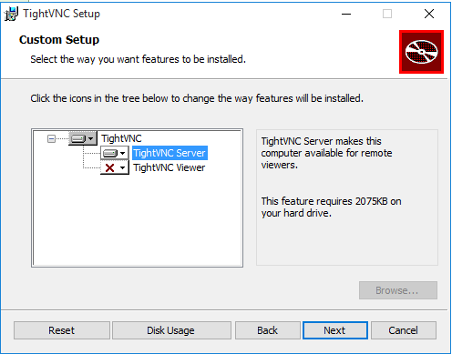
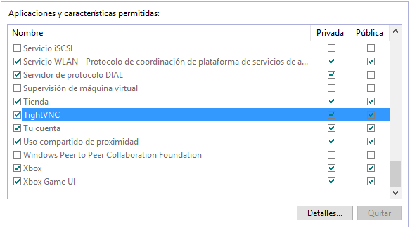
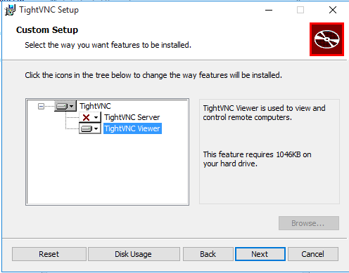
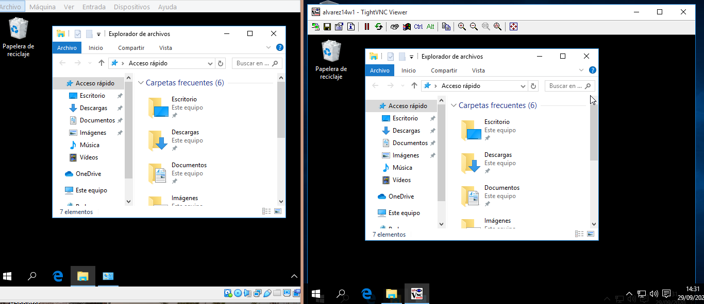
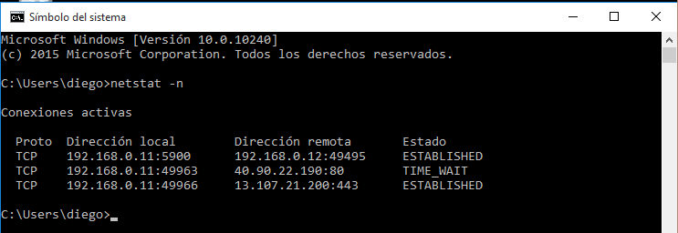

# TightVNC en Windows

# 1. Windows: Slave VNC

Vamos a configurar las Máquinas Virtuales de la siguiente manera:
* Windows (Slave VNC):
```
    · Usuario: diego
    · Nombre de equipo: alvarez14w1
    · Grupo de trabajo: CURSO2021
    · IP: 172.19.14.11
    · Netmask: 255.255.0.0
    · Gateway: 172.19.0.1
    · Servidor DNS 1.1.1.1
```
* Windows (Master VNC):
```
    · Usuario: diego
    · Nombre de equipo: alvarez14w2
    · Grupo de trabajo: CURSO2021
    · IP: 172.19.14.12
    · Netmask: 255.255.0.0
    · Gateway: 172.19.0.1
    · Servidor DNS 1.1.1.1
```

A continuación, vamos a descargar `TightVNC`. Esta es una herramienta libre disponible para Windows.

* En el servidor VNC instalaremos `TightVNC -> Custom -> Server`. Esto es el servicio.



* Vamos a revisar la configuración del cortafuegos del servidor VNC Windows para permitir VNC. Por defecto, tiene activado el acceso tanto de redes públicas como privadas.



## 1.2 Ir a una máquina con GNU/Linux
* Ejecutaremos el comando `nmap -Pn 172.19.14.11`, desde la máquina real GNU/Linux para comprobar que los servicios son visibles desde fuera de la máquina VNC-SERVER. Deben verse los puertos 580X, 590X, etc.

`Insertar imagen`

# 2 Windows: Master VNC
* En el cliente Windows vamos a instalar `TightVNC -> Custom -> Viewer`.



Usaremos TightVNC Viewer. Esto es el cliente VNC.\
Para esta práctica usaremos conexiones SIN cifrar.

## 2.1 Comprobaciones finales
Para verificar que se han establecido las conexiones remotas:

* Haremos una conexión desde el Windows Master hacia el Windows Slave.



* Haremos una segunda conexión desde GNU/Linux Master hacia el Windows Slave.

`Insertar imagen`

* Vamos al servidor VNC y dentro de una consola, usaremos el comando `netstat -n` para ver las conexiones VNC con el cliente.



# 3. openSUSE: Slave VNC
Vamos a configurar las Máquinas Virtuales openSUSE de la siguiente manera:
* openSUSE (Slave VNC):
```
    · Usuario: diego
    · Nombre de equipo: alvarez14g1
    · Grupo de trabajo: CURSO2021
    · IP: 172.19.14.31
    · Netmask: 255.255.0.0
    · Gateway: 172.19.0.1
    · Servidor DNS 1.1.1.1
```
* openSUSE (Master VNC):
```
    · Usuario: diego
    · Nombre de equipo: alvarez14g2
    · Grupo de trabajo: CURSO2021
    · IP: 172.19.14.32
    · Netmask: 255.255.0.0
    · Gateway: 172.19.0.1
    · Servidor DNS 1.1.1.1
```

Vamos a `YaST -> VNC`, y haremos lo siguiente:

* Permitiremos la conexión remota. Esto configura el servicio `xinet`.
* Abriremos los puertos VNC en el cortafuegos.

Vamos a `Yast -> Cortafuegos`, y:
* Revisaremos la configuración del cortafuegos, debe estar permitido las conexiones a `vnc-server`.

Con nuestro `usuario normal`, vamos a ejecutar `vncserver` en el servidor para iniciar el servicio VNC.
>Otra opción: vncserver -interfaz [address].

Pondremos claves para las conexiones VNC a nuestro escritorio.

Al final se nos muestra el número de nuestro escritorio remoto. **Apuntaremos este número** porque lo usaremos más adelante.

* Si ejecutamos el comando `vdir /home/diego/.vnc`, vemos que se nos han creado unos ficheros de configuración VNC asociados a nuestro usuario.

* Vamos a ejecutar `ps -ef | grep vnc` para comprobar que los servicios relacionados con vnc están en ejecución.
Por último, ejecutaremos `lsof -i -n` para comprobar que están los servicios en los puertos VNC (580X y 590X).

## 3.1 Ir a una máquina GNU/Linux
* Ejecutaremos `nmap -Pn 172.19.14.31`, desde la máquina real GNU/Linux para comprobar que los servicios son visibles desde fuera de la máquina VNC-SERVER. Deben verse los puertos VNC (5801, 5901, etc).
