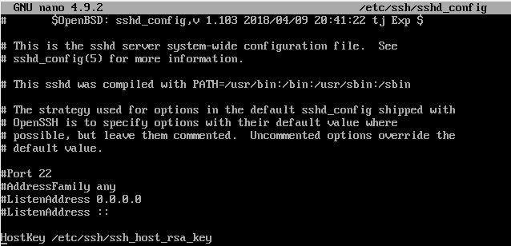
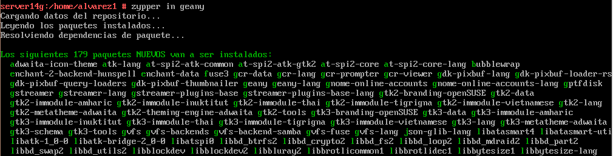
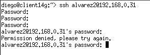
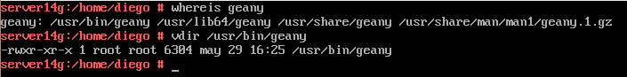

# Acceso remoto SSH

# 1. Preparativos

Vamos a necesitar las siguientes MVs:

| Función | Sistema Operativo     | IP        | Nombre |
| ------- |--------------------- | --------- | --------- |
| Un servidor SSH| GNU/Linux OpenSUSE (Sin entorno gráfico)| 172.19.14.31 | server14g |
| Un cliente SSH | GNU/Linux OpenSUSE | 172.19.14.32 | client14g |
| Un servidor SSH | Windows Server| 172.19.14.11 | server14s |
| Un cliente SSH | Windows | 172.19.14.12 | cliente14w |

## 1.1 Servidor SSH
Configuraremos el servidor GNU/Linux con siguientes valores:
* SO GNU/Linux: OpenSUSE - Sin entorno gráfico
* Nombre de equipo: `server14g`
* Pondremos una clave compleja al usuario root. (server14123)
* Añadiremos en `/etc/hosts` los equipos `client14g` y `client14w`.


Comprobaremos los cambios ejecutando los siguientes comandos:
* `ip a`


* `ip route`


* `ping 8.8.4.4 -i 2`


* `host www.nba.com`


* `ping client14g (con IP de casa)`


* `ping client14w (con IP de casa)`


* `lsblk`


* `blkid`


Crearemos los siguientes usuarios en server14g:
* `alvarez1`, `alvarez2`, `alvarez3`, `alvarez4`


## 1.2 Cliente GNU/Linux
Configuraremos el cliente1 GNU/Linux con los siguientes valores:
* SO OpenSUSE
* Nombre de equipo: `client14g`
* Añadir en `/etc/hosts` los equipos `server14g`, y `client14w`.


* Vamos a comprobar con ping que conecta a los siguientes equipos:

1) `server14g`


2) `client14w`


## 1.3 Cliente Windows
Vamos a instalar el software cliente SSH en Windows. Para este ejemplo usaremos PuTTY.
<<<<<<< HEAD
Configurar el cliente 2 de Windows con los siguientes valores:
* SO Windows
* Nombre de equipo: `client14w`
* Añadiremos en `C:\Windows\System32\drivers\etc\hosts` los equipos `server14g` y `client14g`.
=======

Configurar el cliente2 Windows con los siguientes valores:
* SO Windows
* Nombre de equipo: `client14w`
* Añadir en C:\Windows\System32\drivers\etc\hosts los equipos server14g y client14g.


* Comprobar haciendo `ping` a ambos equipos.


# 2 Instalación del servicio SSH
Instalaremos el servicio SSH en la máquina `server14g`.\
`zypper install openssh`


## 2.1 Comprobación
Desde el propio servidor, verificar que el servicio está en ejecución.
* `systemctl status sshd`, esta es la forma habitual de comprobar los servicios.


* `ps -ef|grep sshd`, esta es otra forma de comprobarlo mirando los procesos del sistema.


> Si el servicio estuviera apagado, ejecutaremos lo siguiente:
systemctl enable sshd

* `sudo lsof -i:22`, comprobar que el servicio está escuchando por el puerto 22.


## 2.2 Primera conexión SSH desde cliente GNU/Linux
Ir al cliente client14g.
* `ping server14g`, comprobar la conectividad con el servidor.


* Con `nmap -Pn server14g`, comprobaremos los puertos abiertos en el servidor (SSH debe estar open). Debe mostrarnos que el puerto 22 está abierto. Si esto falla, debemos comprobar en el servidor la configuración del cortafuegos.


Vamos a comprobar el funcionamiento de la conexión SSH desde cada cliente usando el usuario `alvarez1`.

* Desde el cliente GNU/Linux nos conectamos mediante `ssh alvarez1@server14g`. Capturar imagen del intercambio de claves que se produce en el primer proceso de conexión SSH.


* A partir de ahora cuando nos conectamos sólo nos pide la contraseña:


* Comprobaremos el contenido del fichero `$HOME/.ssh/known_hosts` en el equipo cliente.


¿Te suena la clave que aparece? Es la clave de identificación de la máquina del servidor.
* Una vez llegados a este punto deben de funcionar correctamente las conexiones SSH desde el cliente.


## 2.3 Primera conexión SSH desde cliente Windows
Desde el cliente Windows nos conectaremos usando PuTTY
* Capturaremos una imagen del intercambio de claves que se produce en el primer proceso de conexión SSH.


¿Te suena la clave que aparece? Es la clave de identificación de la máquina del servidor.

Una vez llegados a este punto deben de funcionar correctamente las conexiones SSH desde el cliente.

La siguiente vez que volvamos a usar PuTTY ya no debe aparecer el mensaje de advertencia porque hemos memorizado la identificación del servidor SSH.\


# 3. Cambiamos la identidad del servidor
¿Qué pasaría si cambiamos la identidad del servidor? Esto es, ¿Y si cambiamos las claves del servidor? ¿Qué pasa?

* Los ficheros `ssh_host*key` y `ssh_host*key.pub`, son ficheros de clave pública/privada que identifican a nuestro servidor frente a nuestros clientes. Confirmar que existen el en `/etc/ssh`,:


* Modificar el fichero de configuración SSH (`/etc/ssh/sshd_config`) para dejar una única línea: `HostKey /etc/ssh/ssh_host_rsa_key`. Comentar el resto de líneas con configuración HostKey. Este parámetro define los ficheros de clave publica/privada que van a identificar a nuestro servidor. Con este cambio decimos que sólo se van a utilizar las claves del tipo RSA.




## 3.1 Regenerar certificados
Vamos a cambiar o volver a generar nuevas claves públicas/privadas que identifican nuestro servidor.

* Ir al servidor.
* Como usuario root ejecutamos: `ssh-keygen -t rsa -f /etc/ssh/ssh_host_rsa_key`. ¡OJO! No poner password al certificado.

 

* Reiniciaremos el servicio SSH: `systemctl restart sshd`.


* Comprobar que el servicio está en ejecución correctamente: `systemctl status sshd`.


## 3.2 Comprobamos
Comprobar qué sucede al volver a conectarnos desde los dos clientes, usando los usuarios `alvarez2` y `alvarez1`.

En **linux** nos dice que las llaves SSH han sido cambiadas. Siguiendo el mensaje que nos da, procederemos a borrar la llave anterior para insertar la nueva.\
Comando a ejecutar:`ssh-keygen -R 192.168.0.31 -f /home/diego/.ssh/known_hosts`


Luego de ejecutar el comando, volveremos a realizar la conexión y esta vez si nos dejará conectarnos.


En **windows**, PuTTY te advierte que la llave no está almacenada, y te permite conectarte con el host destino. No te da la seguridad que te da la conexión hecha desde el cliente Linux.


# 4. Personalización del prompt Bash
Por ejemplo, podemos añadir las siguientes líneas al fichero de configuración de `alvarez1` en la máquina servidor (Fichero `/home/alvarez1/.bashrc`)

```
# Se cambia el prompt al conectarse vía SSH

if [ -n "$SSH_CLIENT" ]; then
   PS1="AccesoRemoto_\e[32m\u@\h:\e[0m \w\a\$ "
else
   PS1="\[$(pwd)\]\u@\h:\w>"
fi
```
Además, crearemos el fichero el fichero `/home/alvarez1/.alias`, donde pondremos el siguiente contenido:
```
alias c='clear'
alias g='geany'
alias p='ping'
alias v='vdir -cFl'
alias s='ssh'
```
Comprobaremos el funcionamiento de la conexión SSH desde cada cliente.


# 5. Autenticación mediante claves públicas
Vamos a la máquina `client14g`. \
¡OJO! No usar el usuario root.
* Iniciamos sesión con nuestro usuario "diego" de la máquina `client14g`.
* `ssh-keygen -t rsa` para generar un nuevo par de claves para el usuario en: \
`/home/diego/.ssh/id_rsa` \
`/home/diego/.ssh/id_rsa.pub`


* Ahora vamos a copiar la clave pública (`id_rsa.pub`), al fichero "authorized_keys" del usuario remoto `alvarez4` que está definido en el servidor.


Lo haremos usando el comando `ssh-copy-id`. \
Ejemplo para copiar la clave pública del usuario actual al usuario remoto en la máquina remota: \
`ssh-copy-id alvarez4@server14g`


* Comprobaremos que ahora al acceder remotamente vía SSH desde `client14g` **NO** se pide password, pero desde `client14w`, SI se pide el password.


# 6. Uso de SSH como túnel para X

* Instalaremos en el servidor una aplicación de entorno gráfico (APP1) que no esté en los clientes. Por ejemplo `Geany`. Si estuviera en el cliente entonces buscar otra aplicación o desinstalarla en el cliente.




* Modificar el servidor SSH para permitir la ejecución de aplicaciones gráficas, desde los clientes. Consultar fichero de configuración `/etc/ssh/sshd_config` (Opción X11Forwarding yes)


* Reiniciar el servicio SSH para que se lean los cambios de configuración.


Ahora vamos a `client14g`.

* `zypper se APP1`,comprobar que no está instalado el programa APP1.
Vamos a comprobar desde clientXXg, que funciona APP1(del servidor).


  * `ssh -X alvarez1@server14g`, nos conectamos de forma remota al servidor, y ahora ejecutamos APP1 de forma remota.


# 7. Aplicaciones Windows nativas
Podemos tener aplicaciones Windows nativas instaladas en ssh-server mediante el emulador WINE.
* Instalaremos emulador `Wine` en el `server14g`.
* Ahora podríamos instalar alguna aplicación (APP2) de Windows en el servidor SSH usando el emulador Wine. O podemos usar el Block de Notas que viene con Wine: wine notepad.
* Comprobar el funcionamiento de APP2 en server14g.
> Nota: Al no tener el servidor una interfaz gráfica, no permite ejecutar aplicaciones gráficas, por tanto, intenta ejecutarla pero no logra mostrarla. En cambio, al comprobarla en el cliente, este sí logra ejecutarla satisfactoriamente.


* Comprobar el funcionamiento de APP2, accediendo desde client14g.


# 8. Restricciones de uso
Vamos a modificar los usuarios del servidor SSH para añadir algunas restricciones de uso del servicio.

## 8.1 Restricción sobre un usuario
Vamos a crear una restricción de uso del SSH para un usuario.\
En el servidor tenemos el usuario `alvarez2`. Desde local en el servidor podemos usar sin problemas el usuario.\
Vamos a modificar SSH de modo que al usar el usuario por SSH desde los clientes tendremos permiso denegado.

* Vamos a consultar/modificar el fichero de configuración del servidor SSH (`/etc/ssh/sshd_config`) para restringir el acceso a determinados usuarios.

>Consultar las opciones `AllowUsers`, `DenyUsers` (Más información en: `man sshd_config`).


* `/usr/sbin/sshd -t; echo $?`, comprobar si la sintaxis del fichero de configuración del servicio SSH es correcta (Respuesta 0 => OK, 1 => ERROR).


* Comprobaremos la restricción al acceder desde los clientes.




## 8.2 Restricción sobre una aplicación
Vamos a crear una restricción de permisos sobre determinadas aplicaciones.

* Crear grupo `remoteapps`.


* Incluir al usuario alumno4 en el grupo remoteapps.



* Localizar el programa APP1. Posiblemente tenga permisos 755.


* Poner al programa APP1 el grupo propietario a remoteapps.


* Poner los permisos del ejecutable de APP1 a 750. Para impedir que los usuarios que no pertenezcan al grupo puedan ejecutar el programa.


* Comprobamos el funcionamiento en el servidor en local. \
Con el usuario `diego` no se consigue abrir geany, pero con `alvarez4` si.


* Comprobamos el funcionamiento desde el cliente en remoto (`ssh -X alvarez4@server14g`).


# 9. Servidor SSH en Windows
* Configurar el servidor Windows con los siguientes valores:
    * SO Windows Server
    * Nombre de equipo: `server14s`
Configuración de las MV's
* Añadir en C:\Windows\System32\drivers\etc\hosts los equipos `client14g` y `client14w`.


>>>>>>> fe45bd1a9cb7637f6c88a81160e57c00a345e33b
* Comprobar haciendo ping a ambos equipos.


**Instalación y configuración del servidor SSH en Windows. (OpenSSH)**

* Descargaremos la última versión de OpenSSH-Win64.zip., y la descomprimiremos en `C:\Program files\OpenSSH`.

>En caso de haber descargado la versión de 32 bits (OpenSSH-Win32), extraer el contenido del ZIP en C:\Program files\OpenSSH (x86).

* `PS> cd ‘C:\Program files\OpenSSH`’, Inicia PowerShell como Administrador y movernos hasta `C:\Program files\OpenSSH`:
Ejecutar el script para instalar los servicios “sshd” y “ssh-agent”:

```
PS> Set-ExecutionPolicy –ExecutionPolicy Bypass
PS> .\install-sshd.ps1
```


* Al terminar debe indicar que los servicios se han instalado de forma satisfactoria. Podemos comprobar que se han instalado los servicios con el siguiente comando:
`PS> Get-Service sshd,ssh-agent`


* Vamos a generar las claves (certificados) del servidor:

```
PS> .\ssh-keygen.exe
PS> .\FixHostFilePermissions.ps1 -Confirm:$false
```


* Habilitar la regla de nombre “SSH” en el Firewall de Windows para permitir (Allow) conexiones TCP entrantes (Inbound) en el puerto 22 (SSH): \
`PS> New-NetFirewallRule -Protocol TCP -LocalPort 22 -Direction Inbound -Action Allow -DisplayName SSH`


* Configuraremos los servicios para que inicien automáticamente:

```
PS> Set-Service sshd -StartupType Automatic
PS> Set-Service ssh-agent -StartupType Automatic
```
Iniciamos el servicio: `PS> Start-Service sshd`


* Comprobaremos el acceso SSH desde los clientes Windows y GNU/Linux al servidor SSH Windows.


* `netstat -n` en Windows.


* `lsof -i -n` en GNU/Linux.


