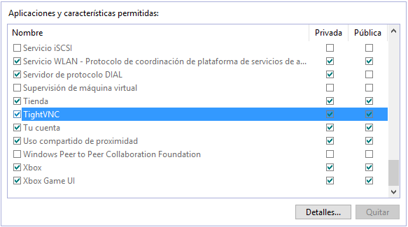
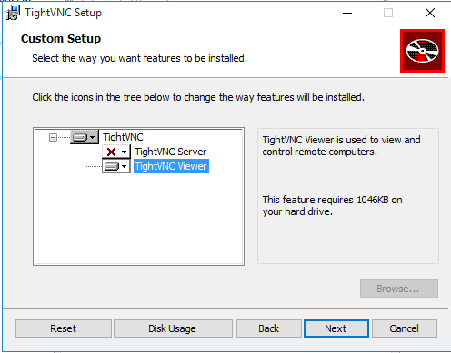
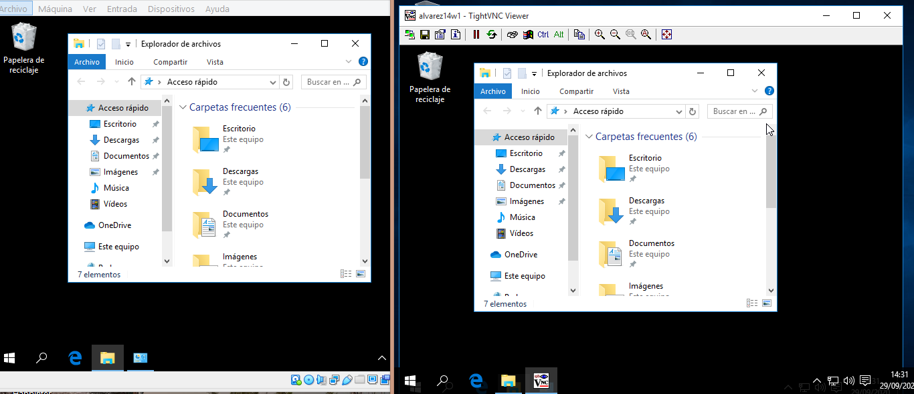
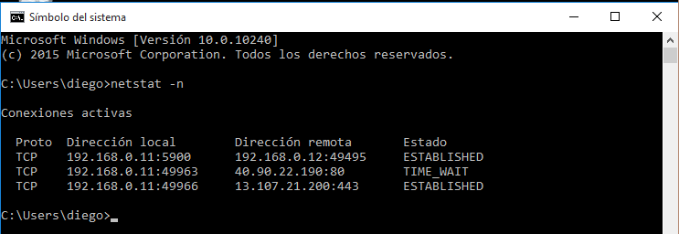

# TightVNC en Windows y openSUSE

# 1. Windows: Slave VNC

Vamos a configurar las Máquinas Virtuales de la siguiente manera:
* Windows (Slave VNC):
```
    · Usuario: diego
    · Nombre de equipo: alvarez14w1
    · Grupo de trabajo: CURSO2021
    · IP: 172.19.14.11
    · Netmask: 255.255.0.0
    · Gateway: 172.19.0.1
    · Servidor DNS 1.1.1.1
```
* Windows (Master VNC):
```
    · Usuario: diego
    · Nombre de equipo: alvarez14w2
    · Grupo de trabajo: CURSO2021
    · IP: 172.19.14.12
    · Netmask: 255.255.0.0
    · Gateway: 172.19.0.1
    · Servidor DNS 1.1.1.1
```

A continuación, vamos a descargar `TightVNC`. Esta es una herramienta libre disponible para Windows.

* En el servidor VNC instalaremos `TightVNC -> Custom -> Server`. Esto es el servicio.


* Vamos a revisar la configuración del cortafuegos del servidor VNC Windows para permitir VNC. Por defecto, tiene activado el acceso tanto de redes públicas como privadas.



## 1.2 Ir a una máquina con GNU/Linux
* Ejecutaremos el comando `nmap -Pn 172.19.14.11`, desde la máquina real GNU/Linux para comprobar que los servicios son visibles desde fuera de la máquina VNC-SERVER. Deben verse los puertos 580X, 590X, etc.


# 2 Windows: Master VNC
* En el cliente Windows vamos a instalar `TightVNC -> Custom -> Viewer`.



Usaremos TightVNC Viewer. Esto es el cliente VNC.\
Para esta práctica usaremos conexiones **SIN cifrar**.

## 2.1 Comprobaciones finales
Para verificar que se han establecido las conexiones remotas:

* Haremos una conexión desde el Windows Master hacia el Windows Slave.




* Vamos al servidor VNC y dentro de una consola, usaremos el comando `netstat -n` para ver las conexiones VNC con el cliente.


