# Samba (con OpenSUSE y Windows)

# 1. Servidor Samba (MV1)
## 1.1 Preparativos

* Configuraremos el servidor GNU/Linux, y usaremos los siguientes valores:
    * Nombre de equipo: `server14g`.
    * Añadiremos en `/etc/hosts` los equipos `client14g` y `client14w`.

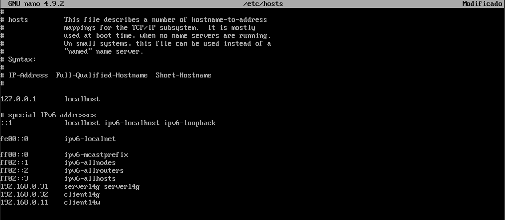

## 1.2 Usuarios locales

Vamos a GNU/Linux, y crearemos los siguientes grupos y usuarios:

* Crearemos los grupos `piratas`, `soldados` y `sambausers`.

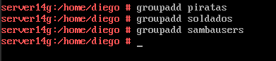
* Crearemos el usuario `sambaguest`. Para asegurarnos que nadie puede usar `sambaguest` para entrar en nuestra máquina mediante login, vamos a modificar este usuario y le ponemos como shell `/bin/false`.


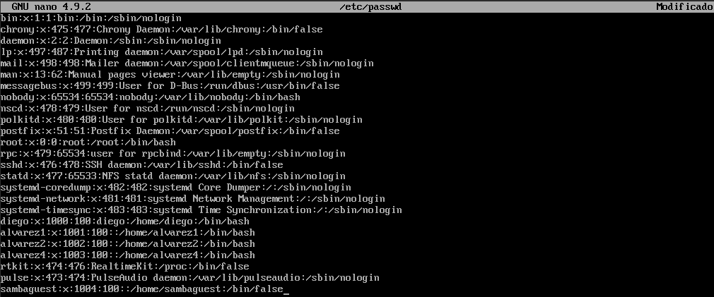

> Podemos hacer estos cambios por entorno gráfico usando YaST, o por comandos editando el fichero /etc/passwd.

* Dentro del grupo piratas incluiremos a los usuarios `pirata1`, `pirata2` y `supersamba`.

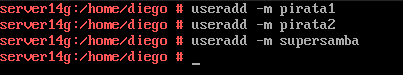
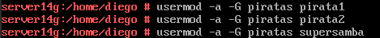


* Dentro del grupo soldados incluiremos a los usuarios `soldado1`, `soldado2` y `supersamba`.


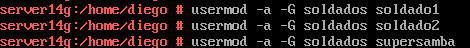


* Dentro del grupo `sambausers`, pondremos a todos los usuarios `soldados`, `piratas`, `supersamba` y a `sambaguest`.

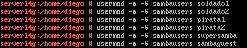


## 1.3 Crear las carpetas para los futuros recursos compartidos

Crearemos la carpeta base para los recursos de red de Samba, y le asignaremos los permisos 755.
* `mkdir /srv/samba14`
* `chmod 755 /srv/samba14`

* Vamos a crear las carpetas de los recursos compartidos con los permisos siguientes:

| Recurso         | Directorio              | Usuario          | Grupo           | Permisos      |
| --------------- | ---------------         | ---------------  | --------------- | ------------- |
| Public          | /srv/samba14/public.d   | supersamba       | sambausers      | 770           |
| Castillo        | /srv/samba14/castillo.d | supersamba       | soldados        | 770           |
| Barco           | /srv/samba14/barco.d    | supersamba       | piratas         | 770           |

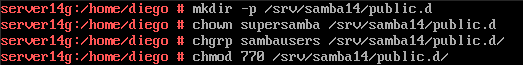

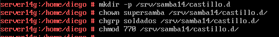

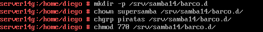


## 1.4 Configurar el servidor Samba

* Vamos a hacer una copia de seguridad del fichero de configuración existente con el siguiente comando: \
`cp /etc/samba/smb.conf /etc/samba/smb.conf.bak`.


> Para instalar y configurar el servicio Samba, podemos usar comandos o el entorno gráfico. Como estamos en OpenSUSE vamos a usar YaST.

* `Yast -> Samba Server`
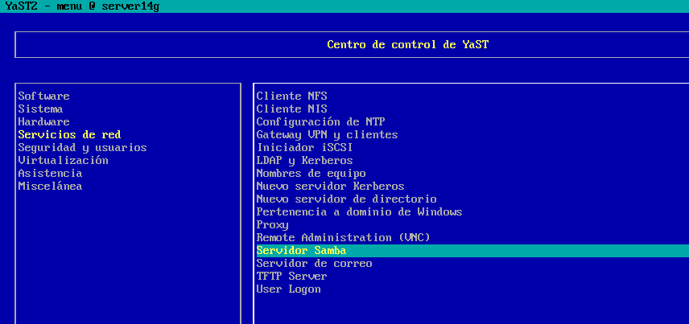
    * Workgroup: `curso2021`
    * Sin controlador de dominio. \
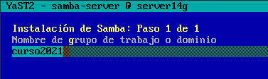
* En la pestaña de `Inicio` definimos:
    * Iniciar el servicio durante el arranque de la máquina.
    * Ajustes del cortafuegos -> Abrir puertos


> **Comprobar CORTAFUEGOS** \
  Para descartar un problema del servidor Samba con el cortafuegos, usaremos el comando nmap -Pn IP-servidor-Samba desde otra máquina GNU/Linux. Los puertos SMB/CIFS (139 y 445) deben estar abiertos.

En este caso, al realizar un nmap, los puertos aparecen como cerrados.
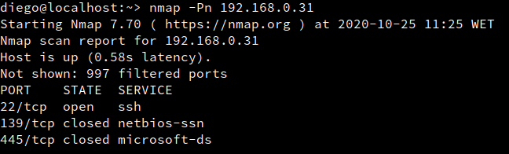 \
Para abrirlos, vamos a abrir yaST -> Seguridad y usuarios -> Cortafuegos.
Dentro, iremos hasta External > puertos e introduciremos los dos puertos que aparecen cerrados separados por un espacio al medio.
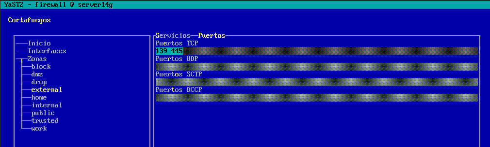
Reiniciamos el servidor, y al realizar un nmap de nuevo, los puertos aparecen abiertos.


## 1.5 Crear los recursos compartidos de Samba

Vamos a configurar los recursos compartidos de red en el servidor.
Podemos hacerlo modificando el fichero de configuración o por entorno gráfico con YaST.

* `Yast -> Samba Server -> Recursos compartidos -> Configurar`.
* Tenemos que conseguir una configuración con las secciones global, public,
barco, y castillo como la siguiente:

> * `public`, será un recurso compartido accesible para todos los usuarios en modo lectura.
> * `barco`, recurso compartido de red de lectura/escritura para todos los piratas.
> * `castillo`, recurso compartido de red de lectura/escritura para todos los soldados.

```
[global]
  netbios name = server14g
  workgroup = curso2021
  server string = Servidor de diego14
  security = user
  map to guest = bad user
  guest account = sambaguest

[public]
  comment = public de diego14
  path = /srv/samba14/public.d
  guest ok = yes
  read only = yes

[castillo]
  comment = castillo de diego14
  path = /srv/samba14/castillo.d
  read only = no
  valid users = @soldados

[barco]
  comment = barco de diego14
  path = /srv/samba14/barco.d
  read only = no
  valid users = pirata1, pirata2
```

* Abrimos una consola para comprobar los resultados.
* `testparm`, verificaremos la sintaxis del fichero de configuración.

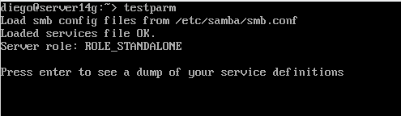
* `more /etc/samba/smb.conf`, consultaremos el contenido del fichero de configuración.

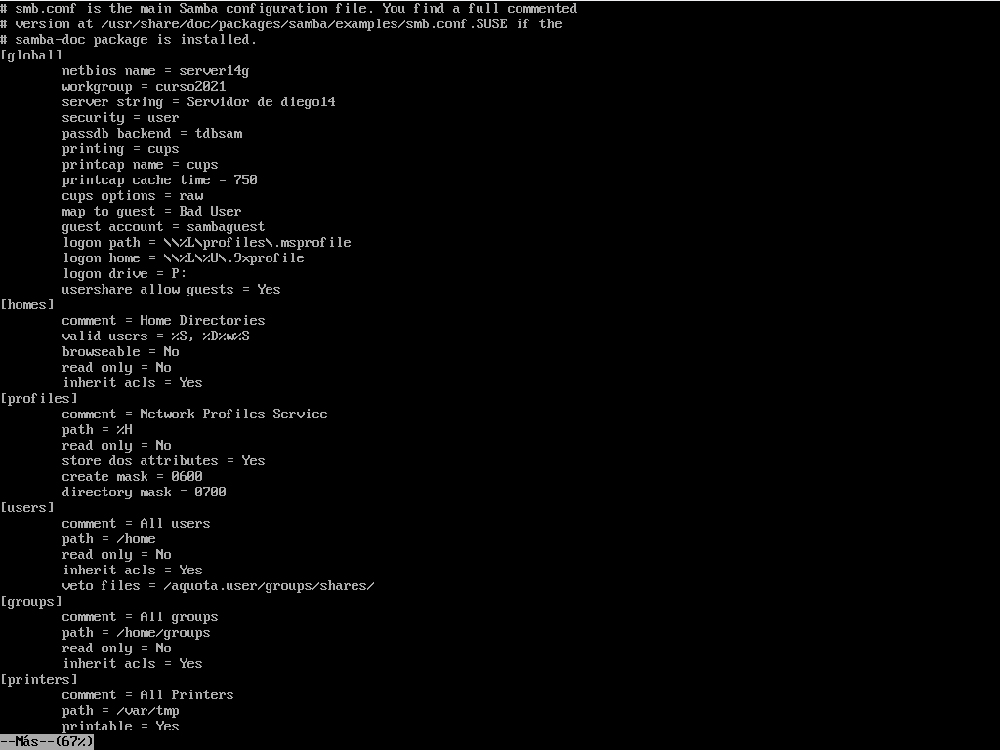 \


## 1.6 Usuarios Samba

Después de crear los usuarios en el sistema, hay que añadirlos a Samba.
* `smbpasswd -a USUARIO`, para crear la clave Samba de `USUARIO`.
    * USUARIO son los usuarios que se conectarán a los recursos comartidos SMB/CIFS.
    * Esto hay que hacerlo para cada uno de los usuarios de Samba. \
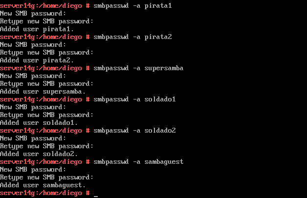

  * `pdbedit -L`, para comprobar la lista de usuarios Samba.\
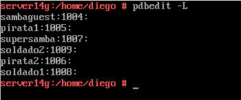

## 1.7 Reiniciar

Ahora que hemos terminado con el servidor, hay que recargar los ficheros de configuración del servicio. Esto es, leer los cambios de configuración.

Podemos hacerlo por `YaST -> Servicios`, o usar los comandos siguientes:
* Servicio smb `systemctl restart smb`
* Servicio nmb `systemctl restart nmb`

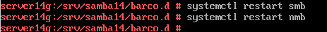

| Comandos Servicio              | Descripción |
| ------------------------------ | ----------- |
| systemctl stop    SERVICE-NAME | Parar |
| systemctl start   SERVICE-NAME | Iniciar |
| systemctl restart SERVICE-NAME | Parar e iniciar |
| systemctl reload  SERVICE-NAME | Volver a releer la configuración |
| systemctl status  SERVICE-NAME | Ver estado |

* `sudo lsof -i`, comprobaremos que el servicio SMB/CIF está a la escucha. \
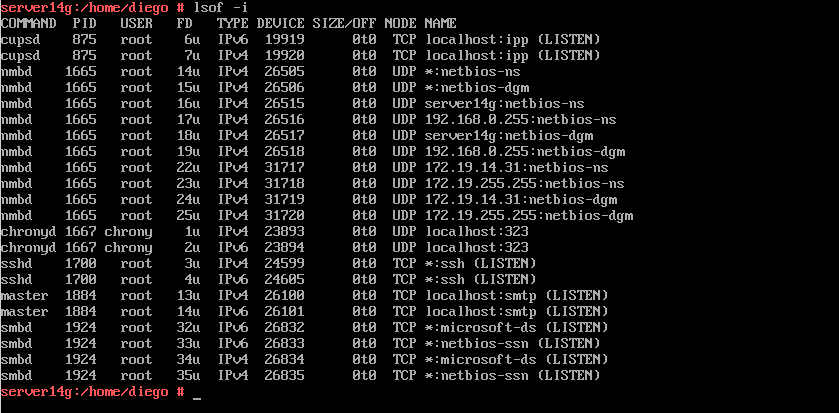

---

# 2. Windows

* Configuraremos el cliente Windows.
* Usaremos el nombre y la IP que hemos establecido al comienzo.
* Configuraremos el fichero `...\etc\hosts` de Windows.
* En los clientes Windows el software necesario viene preinstalado.

## 2.1 Cliente Windows GUI

Desde un cliente Windows vamos a acceder a los recursos compartidos del servidor Samba.

* Escribimos `\\172.19.14.31` y vemos lo siguiente:
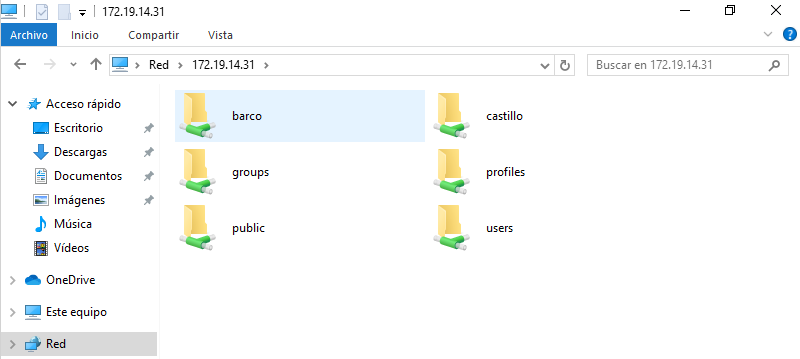   
* Acceder al recurso compartido con el usuario `invitado`
    * `net use` para ver las conexiones abiertas.
    * `net use * /d /y`, para borrar todas las conexión SMB/CIFS que se han realizado.

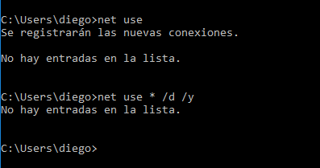  

* Acceder al recurso compartido con el usuario `soldado`:
    * `net use` para ver las conexiones abiertas.
    * `net use * /d /y`, para borrar todas las conexión SMB/CIFS que se han realizado.

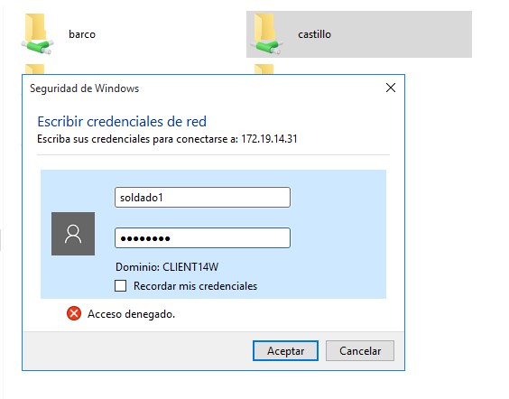

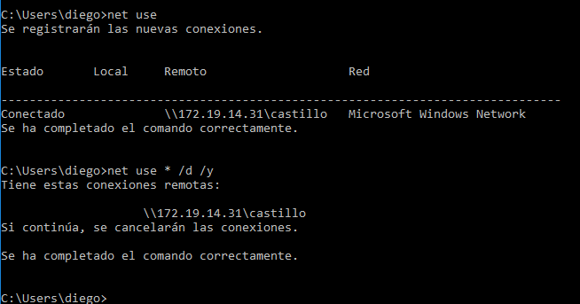    
* Accederemos al recurso compartido con el usuario `pirata`:
    * `net use` para ver las conexiones abiertas.
    * `net use * /d /y`, para borrar todas las conexión SMB/CIFS que se han realizado.\
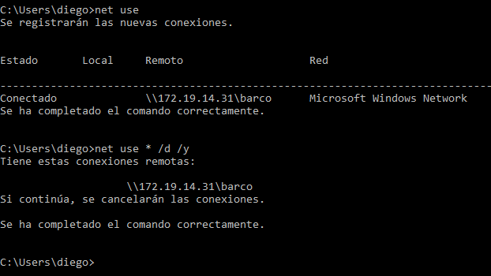

* Iremos al servidor Samba, y ejecutaremos los siguiente comandos:
    * `smbstatus`, desde el servidor Samba. \
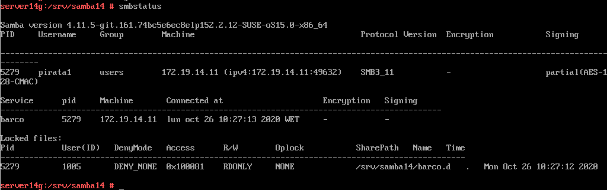    
    * `lsof -i`, desde el servidor Samba. \
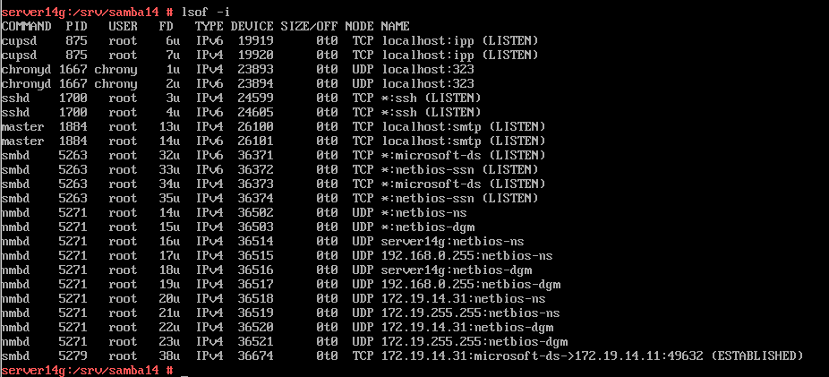    


## 2.2 Cliente Windows comandos

* Abriremos una shell de windows.
* `net use /?`, para consultar la ayuda del comando.
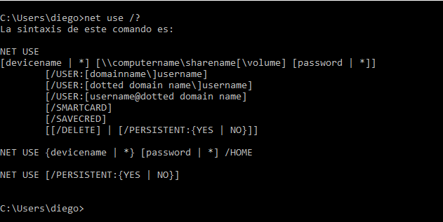    

* `net use`, para consultar todas las conexiones/recursos.

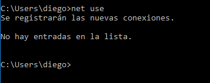    
* Si hubiera alguna conexión abierta la cerramos.
    * `net use * /d /y`, para cerrar las conexiones SMB. \
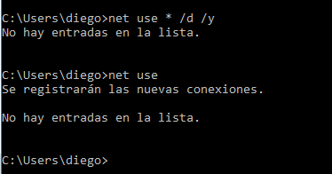    
    * `net use` ahora vemos que NO hay conexiones establecidas. \


* `net view \\172.19.14.31`, para ver los recursos de esta máquina. \
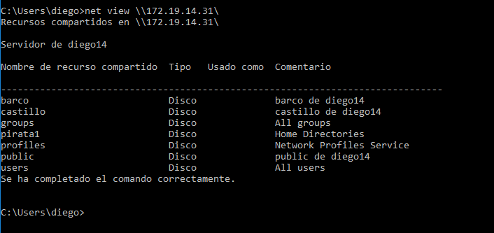    

* `net use S: \\172.19.14.31\barco /USER:pirata1 /p:yes` crear una conexión con el recurso compartido `barco` y lo monta en la unidad S.

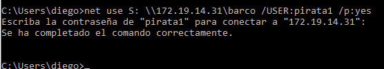    

* `net use`, comprobamos.

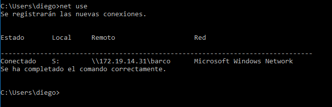

* Ahora podemos entrar en la unidad S ("s:") y crear carpetas, etc.
* Capturar imagen de los siguientes comandos para comprobar los resultados:
    * `smbstatus`, desde el servidor Samba.

    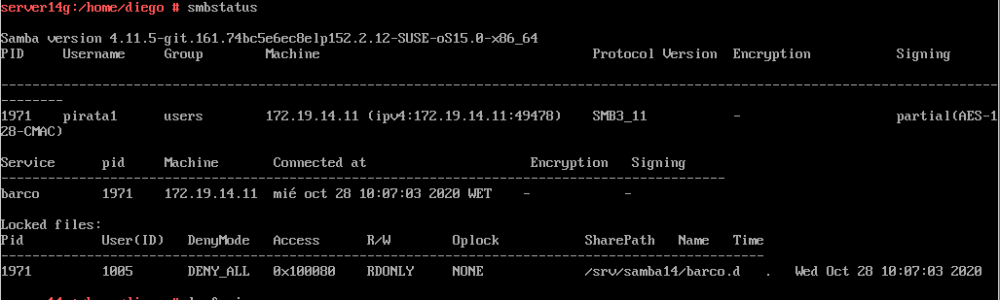

    * `lsof -i`, desde el servidor Samba.

    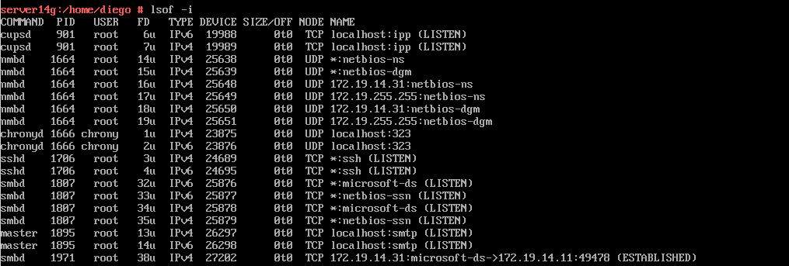


---

# 3 Cliente GNU/Linux

* Configuraremos el cliente GNU/Linux.
* Usar nombre y la IP que hemos establecido al comienzo.
* Configurar el fichero `/etc/hosts` de la máquina.

---

## 3.1 Cliente GNU/Linux GUI

Desde el entorno gráfico, podemos comprobar el acceso a recursos compartidos SMB/CIFS.


Vamos a abrir un explorador de archivos, pulsamos CTRL+L y escribimos `smb://172.19.14.31`:

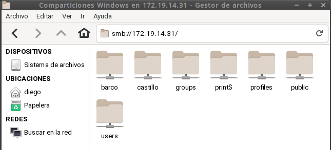

> En el momento de autenticarse para acceder al recurso remoto, poner
en **Dominio** el *nombre-netbios-del-servidor-samba*. \
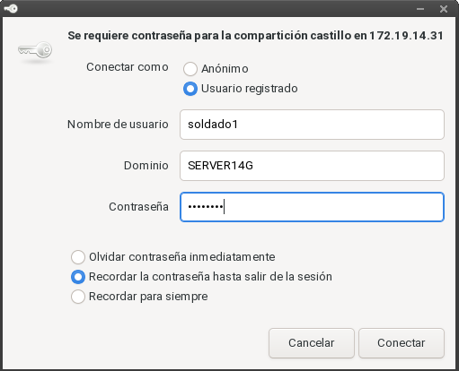

Capturar imagen de lo siguiente:
* Probar a crear carpetas/archivos en `castillo` y en  `barco`.

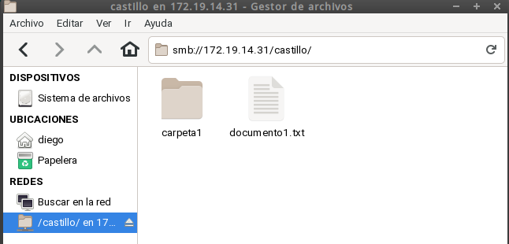


* Comprobar que el recurso `public` es de sólo lectura.

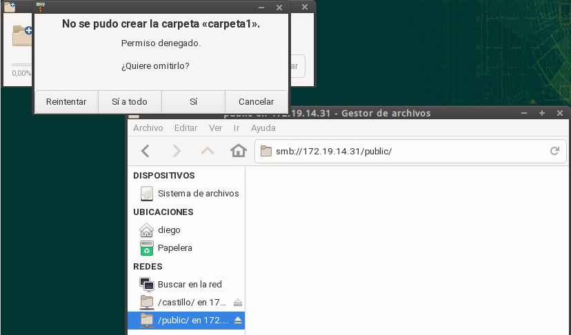

* Capturar imagen de los siguientes comandos para comprobar los resultados:
    * `smbstatus`, desde el servidor Samba.

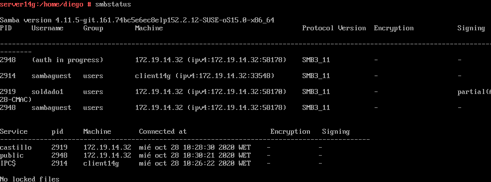

    * `lsof -i`, desde el servidor Samba.

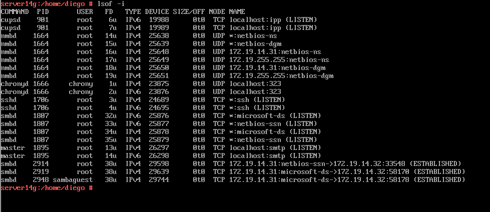

---

## 3.2 Cliente GNU/Linux comandos

* Vamos a un equipo GNU/Linux que será nuestro cliente Samba. Desde este
equipo usaremos comandos para acceder a la carpeta compartida.

* Probar desde OpenSUSE: `smbclient --list 172.19.14.31`, esto nos muestra los recursos SMB/CIFS de un equipo.

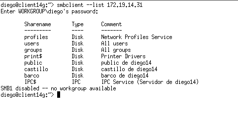

* Ahora crearemos en local la carpeta `/mnt/remoto14/castillo`.
* **MONTAJE MANUAL**: Con el usuario root, usamos el siguiente comando para montar un recurso compartido de Samba Server, como si fuera una carpeta más de nuestro sistema:
`mount -t cifs //172.19.14.31/castillo /mnt/remoto14/castillo -o username=soldado1`

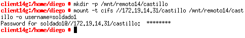

* `df -hT`, para comprobar que el recurso ha sido montado.

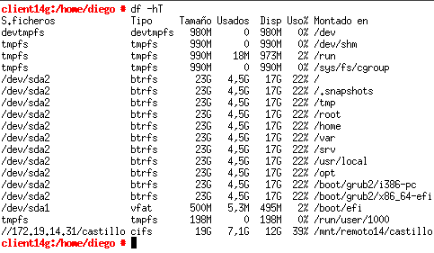

> * Si montamos la carpeta de `castillo`, lo que escribamos en `/mnt/remoto14/castillo`
debe aparecer en la máquina del servidor Samba. ¡Comprobarlo! \
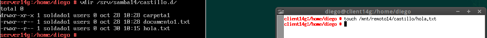
> * Para desmontar el recurso remoto usamos el comando `umount`.

* Capturar imagen de los siguientes comandos para comprobar los resultados:
    * `smbstatus`, desde el servidor Samba.

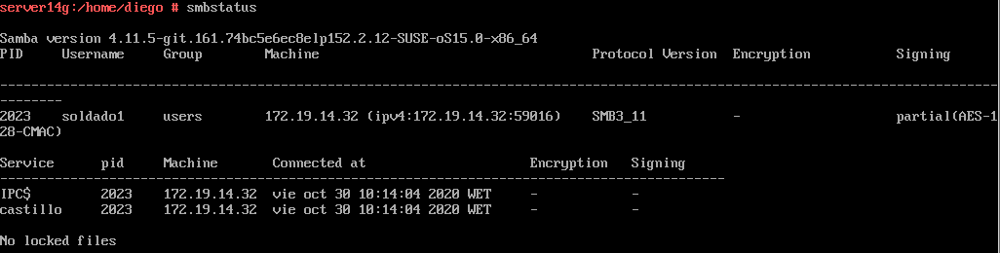

  * `lsof -i`, desde el servidor Samba.

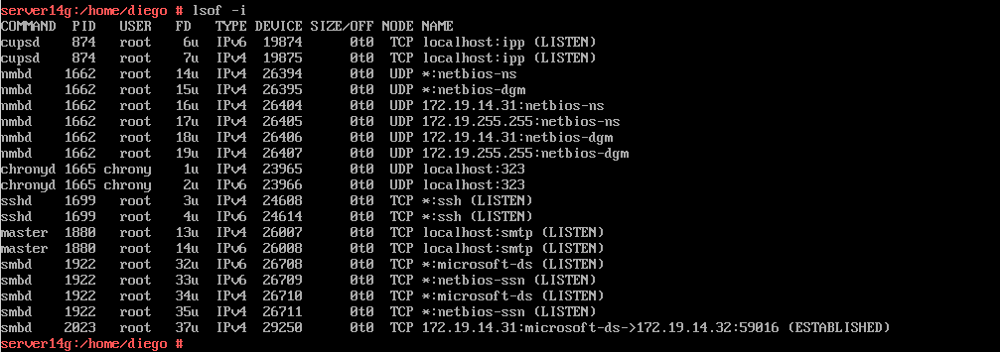


## 3.3 Montaje automático

* Haremos una instantánea de la MV antes de seguir por seguridad.
* Reiniciaremos la MV.
* `df -hT`. Los recursos ya NO están montados. El montaje anterior fue temporal.
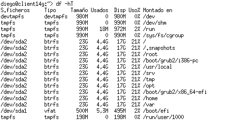

* Para configurar acciones de montajes automáticos cada vez que se inicie el equipo, debemos configurar el fichero `/etc/fstab`. Incluiremos la línea siguiente:
    * `//172.19.14.31/public /mnt/remoto14/public cifs username=soldado1,password=soldado1 0 0`

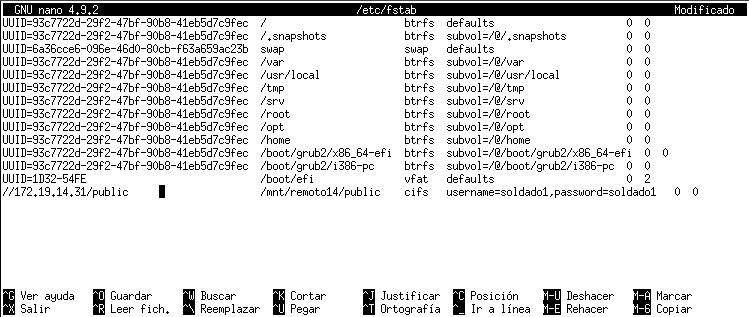

* Reiniciaremos el equipo y comprobaremos que se realiza el montaje automático al inicio.

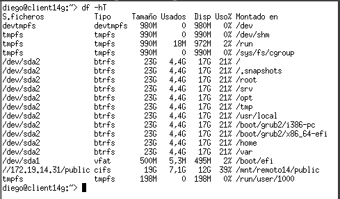


---
