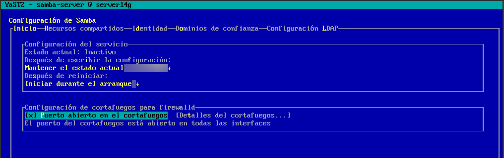
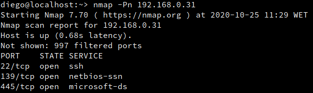
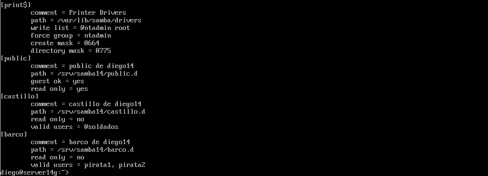

# Samba (con OpenSUSE y Windows)

# 1. Servidor Samba (MV1)
## 1.1 Preparativos

* Configuraremos el servidor GNU/Linux, y usaremos los siguientes valores:
    * Nombre de equipo: `server14g`.
    * Añadiremos en `/etc/hosts` los equipos `client14g` y `client14w`.


## 1.2 Usuarios locales

Vamos a GNU/Linux, y creamos los siguientes grupos y usuarios:

* Crearemos los grupos `piratas`, `soldados` y `sambausers`.


* Crearemos el usuario `sambaguest`. Para asegurarnos que nadie puede usar `sambaguest` para entrar en nuestra máquina mediante login, vamos a modificar este usuario y le ponemos como shell `/bin/false`.


> Podemos hacer estos cambios por entorno gráfico usando Yast, o por comandos editando el fichero /etc/passwd.

* Dentro del grupo piratas incluir a los usuarios `pirata1`, `pirata2` y `supersamba`.


* Dentro del grupo soldados incluir a los usuarios `soldado1`, `soldado2` y `supersamba`.


* Dentro del grupo `sambausers`, poner a todos los usuarios `soldados`, `piratas`, `supersamba` y a `sambaguest`.


## 1.3 Crear las carpetas para los futuros recursos compartidos

Creamos la carpeta base para los recursos de red de Samba:
* `mkdir /srv/samba14`
* `chmod 755 /srv/samba14`


* Vamos a crear las carpetas de los recursos compartidos con los permisos siguientes:

| Recurso         | Directorio              | Usuario          | Grupo           | Permisos      |
| --------------- | ---------------         | ---------------  | --------------- | ------------- |
| Public          | /srv/samba14/public.d   | supersamba       | sambausers      | 770           |
| Castillo        | /srv/samba14/castillo.d | supersamba       | soldados        | 770           |
| Barco           | /srv/samba14/barco.d    | supersamba       | piratas         | 770           |


## 1.4 Configurar el servidor Samba

* Vamos a hacer una copia de seguridad del fichero de configuración existente
`cp /etc/samba/smb.conf /etc/samba/smb.conf.bak`.


> Para instalar y configurar el servicio Samba, podemos usar comandos o el entorno gráfico. Como estamos en OpenSUSE vamos a usar Yast.

* `Yast -> Samba Server`

    * Workgroup: `curso2021`
    * Sin controlador de dominio.


* En la pestaña de `Inicio` definimos
    * Iniciar el servicio durante el arranque de la máquina.
    * Ajustes del cortafuegos -> Abrir puertos


> **Comprobar CORTAFUEGOS** \
  Para descartar un problema del servidor Samba con el cortafuegos, usaremos el comando nmap -Pn IP-servidor-Samba desde otra máquina GNU/Linux. Los puertos SMB/CIFS (139 y 445) deben estar abiertos.

En este caso, al realizar un nmap, los puertos aparecen como cerrados.
 \
Para abrirlos, vamos a abrir yaST -> Seguridad y usuarios -> Cortafuegos.
Dentro, iremos hasta External > puertos e introduciremos los dos puertos que aparecen cerrados separados por un espacio al medio.

Reiniciamos el servidor, y al realizar un nmap de nuevo, los puertos aparecen abiertos.



## 1.5 Crear los recursos compartidos de Samba

Vamos a configurar los recursos compartidos de red en el servidor.
Podemos hacerlo modificando el fichero de configuración o por entorno gráfico con YaST.

* Capturar imágenes del proceso.
* `Yast -> Samba Server -> Recursos compartidos -> Configurar`.
* Tenemos que conseguir una configuración con las secciones global, public,
barco, y castillo como la siguiente:

> * `public`, será un recurso compartido accesible para todos los usuarios en modo lectura.
> * `barco`, recurso compartido de red de lectura/escritura para todos los piratas.
> * `castillo`, recurso compartido de red de lectura/escritura para todos los soldados.

```
[global]
  netbios name = server14g
  workgroup = curso2021
  server string = Servidor de diego14
  security = user
  map to guest = bad user
  guest account = sambaguest

[public]
  comment = public de diego14
  path = /srv/samba14/public.d
  guest ok = yes
  read only = yes

[castillo]
  comment = castillo de diego14
  path = /srv/samba14/castillo.d
  read only = no
  valid users = @soldados

[barco]
  comment = barco de diego14
  path = /srv/samba14/barco.d
  read only = no
  valid users = pirata1, pirata2
```

* Abrimos una consola para comprobar los resultados.
    * `testparm`, verificaremos la sintaxis del fichero de configuración.


    * `more /etc/samba/smb.conf`, consultaremos el contenido del fichero de configuración.

 \


## 1.6 Usuarios Samba

Después de crear los usuarios en el sistema, hay que añadirlos a Samba.
* `smbpasswd -a USUARIO`, para crear clave Samba de USUARIO.
    * USUARIO son los usuarios que se conectarán a los recursos comartidos SMB/CIFS.
    * Esto hay que hacerlo para cada uno de los usuarios de Samba. \


* `pdbedit -L`, para comprobar la lista de usuarios Samba.\


## 1.7 Reiniciar

Ahora que hemos terminado con el servidor, hay que recargar los ficheros de configuración del servicio. Esto es, leer los cambios de configuración.

Podemos hacerlo por `Yast -> Servicios`, o usar los comandos.
* Servicio smb `systemctl restart smb`
* Servicio nmb `systemctl restart nmb`


| Comandos Servicio              | Descripción |
| ------------------------------ | ----------- |
| systemctl stop    SERVICE-NAME | Parar |
| systemctl start   SERVICE-NAME | Iniciar |
| systemctl restart SERVICE-NAME | Parar e iniciar |
| systemctl reload  SERVICE-NAME | Volver a releer la configuración |
| systemctl status  SERVICE-NAME | Ver estado |

* Capturar imagen de los siguientes comandos de comprobación:

`sudo lsof -i`, comprobaremos que el servicio SMB/CIF está a la escucha. \


---

# 2. Windows

* Configurar el cliente Windows.
* Usar nombre y la IP que hemos establecido al comienzo.
* Configurar el fichero `...\etc\hosts` de Windows.
* En los clientes Windows el software necesario viene preinstalado.

---

## 2.1 Cliente Windows GUI

Desde un cliente Windows vamos a acceder a los recursos compartidos del servidor Samba.

* Escribimos `\\172.19.14.31` y vemos lo siguiente:
   
* Acceder al recurso compartido con el usuario `invitado`
    * `net use` para ver las conexiones abiertas.
    * `net use * /d /y`, para borrar todas las conexión SMB/CIFS que se han realizado.

  

* Acceder al recurso compartido con el usuario `soldado`
    * `net use` para ver las conexiones abiertas.
    * `net use * /d /y`, para borrar todas las conexión SMB/CIFS que se han realizado.


    
* Acceder al recurso compartido con el usuario `pirata`:


* Ir al servidor Samba.
* Capturar imagen de los siguientes comandos para comprobar los resultados:
    * `smbstatus`, desde el servidor Samba.

    
    * `lsof -i`, desde el servidor Samba.
    

---

## 2.2 Cliente Windows comandos

* Abrir una shell de windows.
* `net use /?`, para consultar la ayuda del comando.
* `net use`, para consultar todas las conexiones/recursos conectados hacemos .
* Si hubiera alguna conexión abierta la cerramos.
    * `net use * /d /y`, para cerrar las conexiones SMB.
    * `net use` ahora vemos que NO hay conexiones establecidas.

Capturar imagen de los comandos siguientes:
* `net view \\IP-SERVIDOR-SAMBA`, para ver los recursos de esta máquina.

> Para REVISAR:
> * `net view`, para ver las máquinas (SMB/CIFS) accesibles por la red.
> * [Error 6118](https://stackoverflow.com/questions/13676714/command-prompt-net-view-system-error-6118) que aparece el ejecutar `net view` en Windows.

* `net use S: \\IP-SERVIDOR-SAMBA\recurso clave /USER:usuario /p:yes` crear una conexión con el recurso compartido y lo monta en la unidad S.
    * Probar a montar el recurso `barco`.

> Con la opción /p:yes hacemos el montaje persistente. De modo que se mantiene en cada reinicio de máquina.

* `net use`, comprobamos.
* Ahora podemos entrar en la unidad S ("s:") y crear carpetas, etc.
* Capturar imagen de los siguientes comandos para comprobar los resultados:
    * `smbstatus`, desde el servidor Samba.
    * `lsof -i`, desde el servidor Samba.

---

# 3 Cliente GNU/Linux

* [Configurar](../../global/configuracion/opensuse.md) el cliente GNU/Linux.
* Usar nombre y la IP que hemos establecido al comienzo.
* Configurar el fichero `/etc/hosts` de la máquina.

---

## 3.1 Cliente GNU/Linux GUI

Desde en entorno gráfico, podemos comprobar el acceso a recursos compartidos SMB/CIFS.

> Estas son algunas herramientas:
> * Yast en OpenSUSE
> * Nautilus en GNOME
> * Konqueror en KDE
> * En Ubuntu podemos ir a "Lugares -> Conectar con el servidor..."
> * También podemos instalar "smb4k".
> * existen otras para otros entornos gráficos. Busca en tu GNU/Linux la forma de acceder vía GUI.

Ejemplo accediendo al recurso prueba del servidor Samba,
pulsamos CTRL+L y escribimos `smb://IP-SERVIDOR-SAMBA`:


> En el momento de autenticarse para acceder al recurso remoto, poner
en **Dominio** el *nombre-netbios-del-servidor-samba*.

Capturar imagen de lo siguiente:
* Probar a crear carpetas/archivos en `castillo` y en  `barco`.
* Comprobar que el recurso `public` es de sólo lectura.
* Capturar imagen de los siguientes comandos para comprobar los resultados:
    * `smbstatus`, desde el servidor Samba.
    * `lsof -i`, desde el servidor Samba.

---

## 3.2 Cliente GNU/Linux comandos

Capturar imagenes de todo el proceso.

> Existen comandos (`smbclient`, `mount` , `smbmount`, etc.) para ayudarnos
a acceder vía comandos al servidor Samba desde el cliente.
> Puede ser que con las nuevas actualizaciones y cambios de las distribuciones
alguno haya cambiado de nombre. ¡Ya lo veremos!

* Vamos a un equipo GNU/Linux que será nuestro cliente Samba. Desde este
equipo usaremos comandos para acceder a la carpeta compartida.

> * Probar desde una máquina Ubuntu `sudo smbtree` (REVISAR: no muestra nada)
>    * Esto muestra todos los equipos/recursos de la red SMB/CIFS.
>    * Hay que parar el cortafuegos para que funcione (`systemctl stop firewalld`), o bien
>    * ejecutar comando desde la máquina real.

* Probar desde OpenSUSE: `smbclient --list IP-SERVIDOR-SAMBA`, Muestra los recursos SMB/CIFS de un equipo.
* Ahora crearemos en local la carpeta `/mnt/remotoXX/castillo`.
* **MONTAJE MANUAL**: Con el usuario root, usamos el siguiente comando para montar un recurso compartido de Samba Server, como si fuera una carpeta más de nuestro sistema:
`mount -t cifs //172.AA.XX.55/castillo /mnt/remotoXX/castillo -o username=soldado1`

> En versiones anteriores de GNU/Linux se usaba el comando

`smbmount //smb-serverXX/public /mnt/remotoXX/public/ -o -username=smbguest`.

* `df -hT`, para comprobar que el recurso ha sido montado.


> * Si montamos la carpeta de `castillo`, lo que escribamos en `/mnt/remotoXX/castillo`
debe aparecer en la máquina del servidor Samba. ¡Comprobarlo!
> * Para desmontar el recurso remoto usamos el comando `umount`.

* Capturar imagen de los siguientes comandos para comprobar los resultados:
    * `smbstatus`, desde el servidor Samba.
    * `lsof -i`, desde el servidor Samba.

## 3.3 Montaje automático

* Hacer una instantánea de la MV antes de seguir. Por seguridad.
* Capturar imágenes del proceso.
* Reiniciar la MV.
* `df -hT`. Los recursos ya NO están montados. El montaje anterior fue temporal.

> Antes accedimos a los recursos remotos, realizando un montaje de forma manual (comandos mount/umount). Si reiniciamos el equipo cliente, podremos ver que los montajes realizados de forma manual ya no están. Si queremos volver a acceder a los recursos remotos debemos repetir el proceso de  montaje manual, a no ser que hagamos una configuración de  montaje permanente o automática.

* Para configurar acciones de montaje automáticos cada vez que se inicie el equipo,
debemos configurar el fichero `/etc/fstab`. Veamos un ejemplo:
    * `//smb-serverXX/public /mnt/remotoXX/public cifs username=soldado1,password=clave 0 0`
* Reiniciar el equipo y comprobar que se realiza el montaje automático al inicio.
* Incluir contenido del fichero `/etc/fstab` en la entrega.

---

# 4. Preguntas para resolver

Servicio y programas:

* ¿Por qué tenemos dos servicios (smb y nmb) para Samba?

Usuarios:

* ¿Las claves de los usuarios en GNU/Linux deben ser las mismas que las que usa Samba?
* ¿Puedo definir un usuario en Samba llamado soldado3, y que no exista como usuario del sistema?
* ¿Cómo podemos hacer que los usuarios soldado1 y soldado2 no puedan acceder al sistema pero sí al samba? (Consultar `/etc/passwd`)

Recursos compartidos:

* Añadir el recurso `[homes]` al fichero `smb.conf` según los apuntes. ¿Qué efecto tiene?

> Para REVISAR
> * ¿Cómo pueden los clientes acceder al CDROM del servidor usando Samba?
>    * /dev/cdrom ¿Dónde apunta? ¿Qué permisos tiene?
>    * /dev/sr0 ¿Que permisos tiene?
