# Servidor de Impresión en Windows

Necesitaremos 2 MV:
* MV1: Windows Server 2016
* MV2: Windows 7 o 10 que harán de cliente

---

# 1. Impresora compartida

## 1.1 Rol impresión

* Vamos al servidor e instalaremos el rol de servidor de impresión. Incluiremos también impresión por Internet.
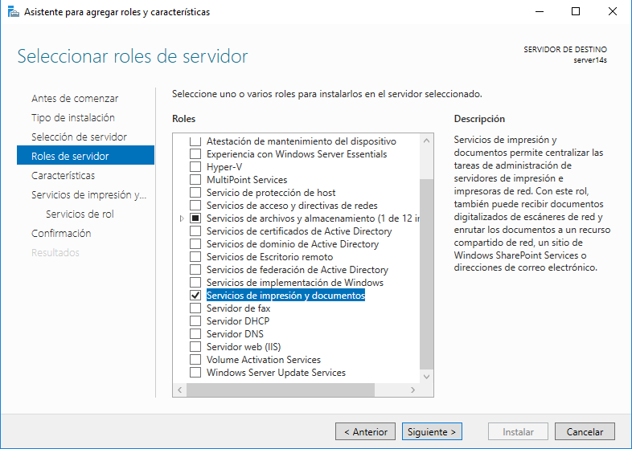

  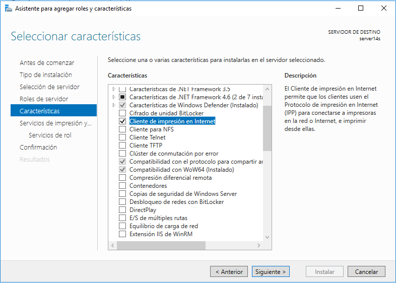
> Instalaremos también el rol/función de cliente de impresión por Internet.
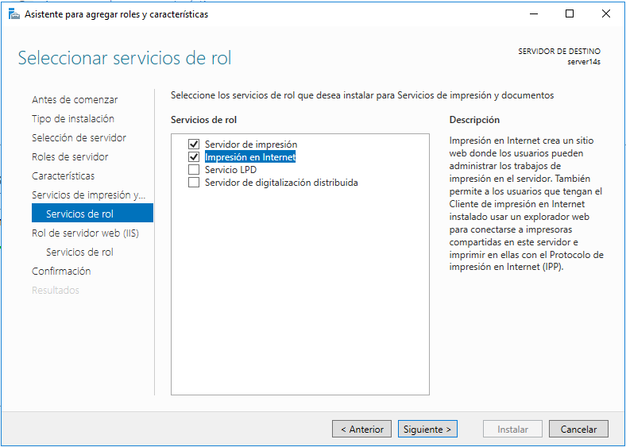

## 1.2 Instalar impresora PDF

Vamos a conectar e instalar localmente una impresora al servidor Windows Server, de modo que estén disponibles para ser accedidas por los clientes del dominio.

En nuestro caso, vamos a instalar un programa que simule una impresora de PDF.

PDFCreator es una utilidad completamente gratuita con la que podrás crear archivos PDF desde cualquier aplicación, desde el Bloc de notas hasta Word, Excel, etc. Este programa funciona simulando ser una impresora, de esta forma, instalando PDFCreator todas tus aplicaciones con opción para imprimir te permitirán crear archivos PDF en cuestión de segundos.

* Descargaremos PDFCreator desde la siguiente URL recomendada ()`www.pdfforge.org/pdfcreator/download`) y lo instalaremos. \
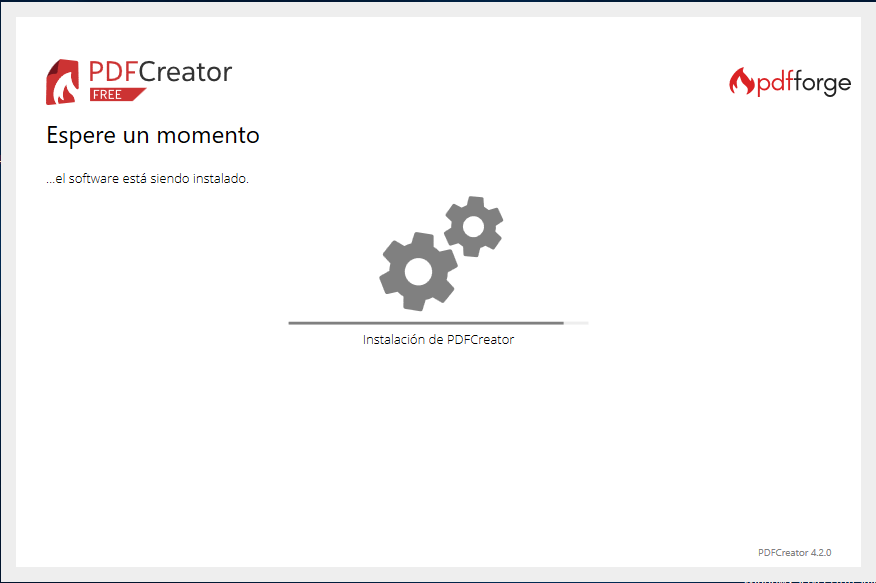

* En PDFCreator, configuraremos en `perfiles -> Guardar -> Automático`, y ahí establecemos la carpeta destino. \
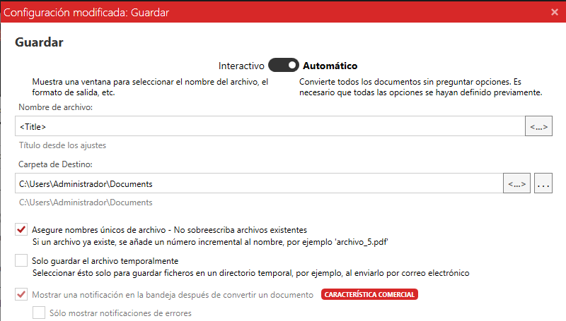

> NOTA: PDFCreator puede requerir NET FrameWork v4.

## 1.3 Probar la impresora en local

Para crear un archivo PDF no hará falta que cambies la aplicación que estés usando, simplemente ve a la opción de imprimir y selecciona "Impresora PDF", en segundos tendrás creado tu archivo PDF. \
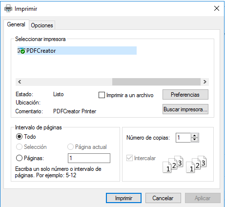

Puedes probar la nueva impresora abriendo el Bloc de notas y creando un fichero luego selecciona imprimir. Cuando finalice el proceso se abrirá un fichero PDF con el resultado de la impresión.

* Probaremos la impresora remota imprimiendo un documento llamado `imprimir14s-local`. \
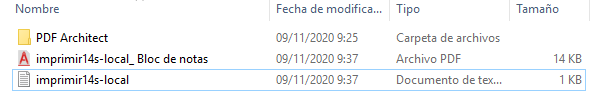

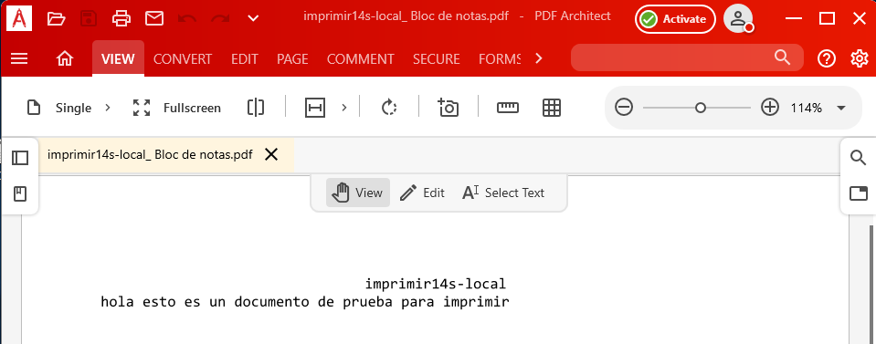
---

# 2. Compartir por red

## 2.1 En el servidor

Vamos a la MV del servidor.
* Iremos al `Administrador de Impresión -> Impresoras`
* Elegiremos la impresora PDFCreator. \
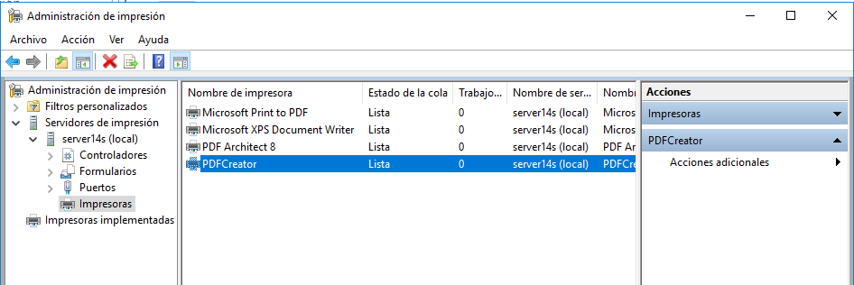
    * `Botón derecho -> Propiedades -> Compartir`
    * Como nombre del recurso compartido utilizaremos `PDFdiego14`. \
    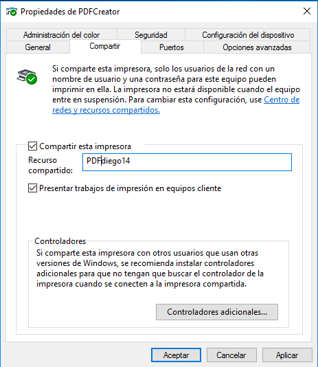

## 2.2 Comprobar desde el cliente

Vamos al cliente:
* Buscar recursos de red del servidor. Si tarda en aparecer ponemos `\\172.19.14.21` en la barra de navegación. \
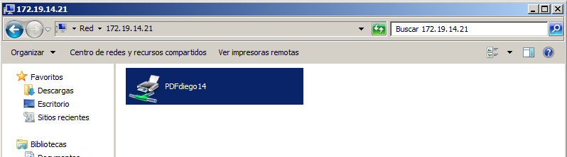
* Seleccionar impresora -> botón derecho -> conectar.
    * Ponemos usuario/clave del Windows Server. \
    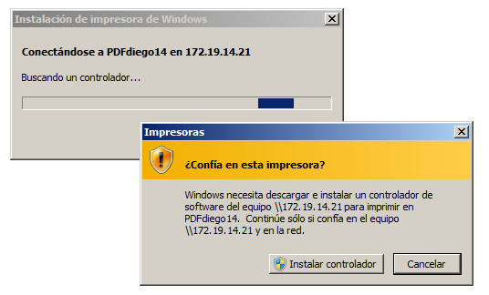
* Ya tenemos la impresora remota configurada en el cliente.
* Probar la impresora remota imprimiendo documento `imprimir14w-remoto`. \
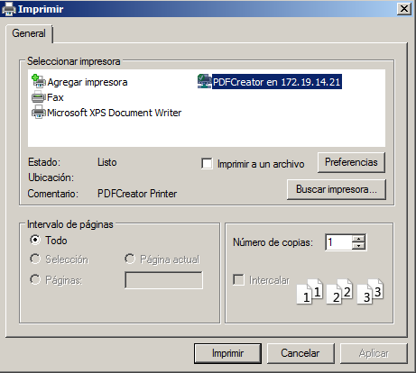

  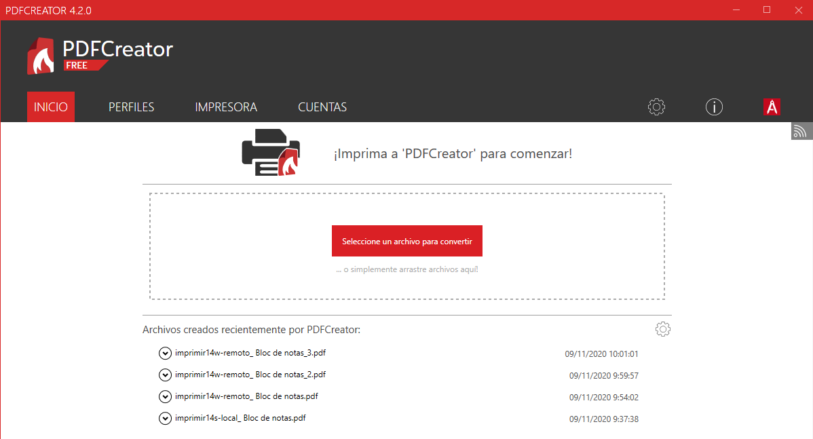

  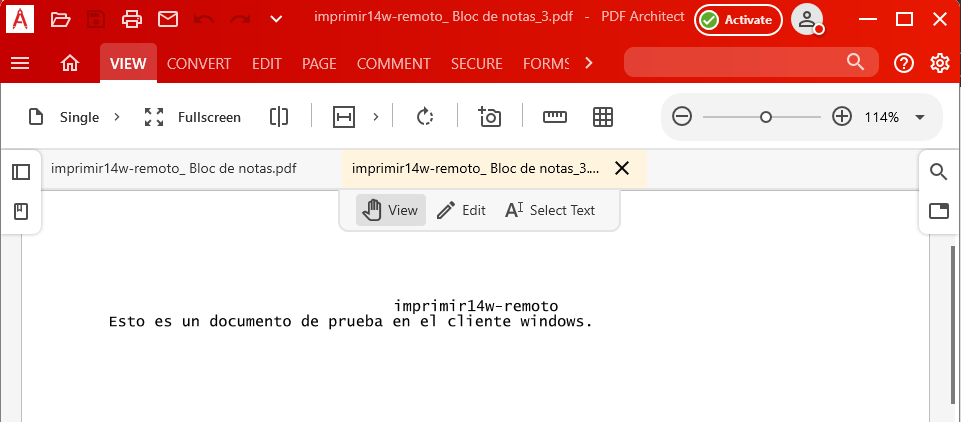

---

# 3. Acceso Web

Realizaremos una configuración para habilitar el acceso web a las impresoras del dominio.

## 3.1 Instalar característica impresión WEB

* Vamos al servidor.
* Nos aseguramos de tener instalado el servicio "Impresión de Internet".

## 3.2 Configurar impresión WEB

Vamos a la MV cliente:
* Abrimos un navegador Web.
* Ponemos la siguiente URL `http://<ip-del-servidor>/printers`
(o `http://<nombre-del-servidor>/printers`) para que aparezca en nuestro navegador un entorno que permite gestionar las impresoras de dicho equipo, previa autenticación como uno de los usuarios del habilitados para dicho fin (por ejemplo el "Administrador"). \
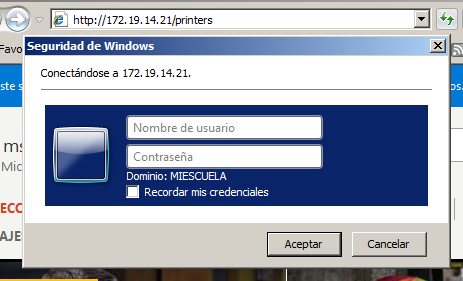
* Pincha en la opción propiedades y captura lo que se ve. \
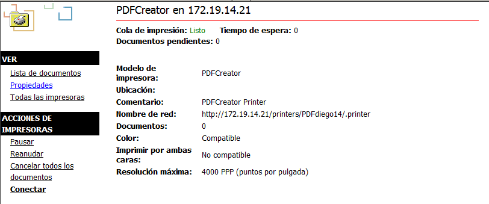

* Agregar impresora (NO es local)
* Crear nueva impresora usando el URL anterior. \

  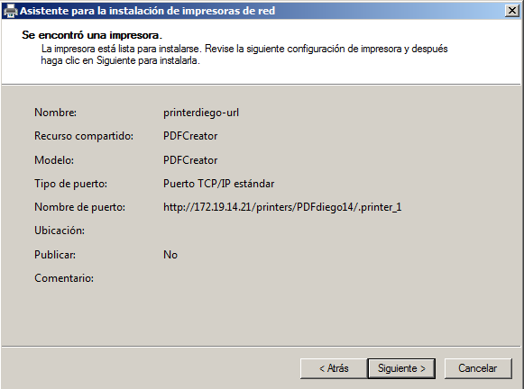

  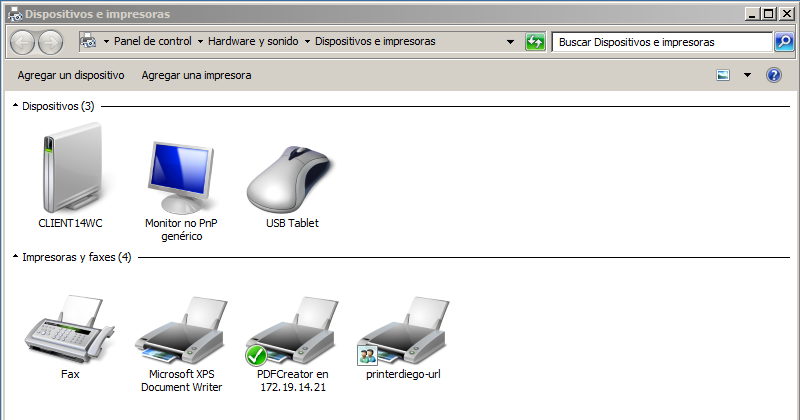

## 3.3 Comprobar desde el navegador

> * **Comprobaremos que la versión Free tiene limitaciones.** \
Si accedemos al apartado de perfiles, vemos que hay una limitación que requiere comprar la versión comercial. \
  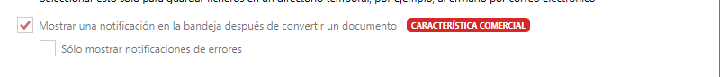

Vamos a realizar seguidamente una prueba sencilla en tu impresora de red:
* Accederemos a la configuración de la impresora a través del navegador.
    * Ponemos en `pausa` los trabajos de impresión de la impresora. \
    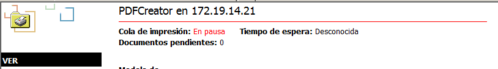
* Vamos a la MV cliente.
* Probaremos la impresora remota imprimiendo el documento `imprimir14w-web`.
    * Comprobamos que al estar la impresora en pausa, el trabajo aparece en cola de impresión. \
    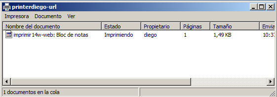
* Finalmente pulsamos en reanudar el trabajo para que el documento se convierta a PDF. \
    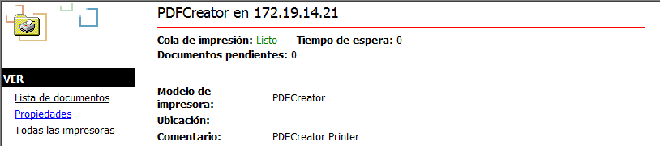
* Si tenemos problemas para que aparezca el PDF en el servidor, iniciaremos el
programa PDFCreator y esperaremos un poco. \
    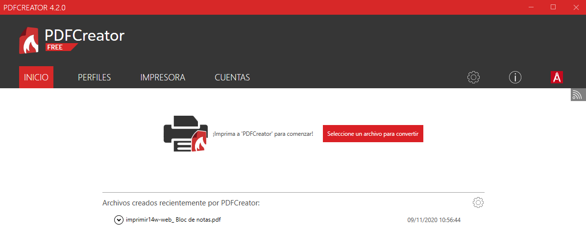

---
