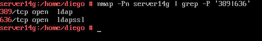
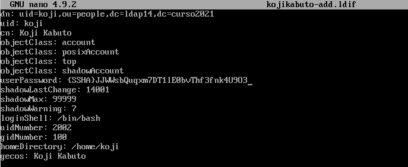

# Servicio de Directorio con comandos

## 1. Nombre de equipo FQDN

* Vamos a usar una MV OpenSUSE para montar nuestro servidor LDAP.
* Nuestra máquina debe tener un FQDN=`server14.curso1920`.
    * Revisaremos `/etc/hostname`
    * Revisaremos `/etc/hosts`

```
127.0.0.2   server14g.curso2021   server14g
```


* Comprobaremos la salida de: `hostname -a`, `hostname -d` y `hostname -f`. \

---

# 2. Instalar el Servidor LDAP

## 2.1 Instalación del paquete

* Abriremos una consola como root.
* Con el comando `zypper in 389-ds`, vamos a instalar el script de instalación. \


* `rpm -qa | grep 389-ds`, comprobar que la versión es >= 1.4.* \


## 2.2 Configurar la instancia

* Crear el fichero `/root/instance.inf` con el siguiente contenido. Este fichero sirve para configurar el servidor:

```
# /root/instance.inf
[general]
config_version = 2

[slapd]
root_password = (contraseña)

[backend-userroot]
sample_entries = yes
suffix = dc=ldap14,dc=curso2021
```


* `dscreate from-file /root/instance.inf`, creamos una nueva instancia.
* `dsctl localhost status`, comprobar el estado actual de la instancia de la base de datos LDAP. \

* Creamos el fichero `/root/.dsrc` con el siguiente contenido. Este fichero sirve para configurar los permisos para acceder a la base de datos como administrador:

```
# cat ~/.dsrc
[localhost]
# Note that '/' is replaced to '%%2f'.
uri = ldapi://%%2fvar%%2frun%%2fslapd-localhost.socket
basedn = dc=ldap14,dc=curso2021
binddn = cn=Directory Manager
```

## 2.3 Comprobamos el servicio

* `systemctl status dirsrv@localhost`, comprobar si el servicio está en ejecución. \

* `nmap -Pn server14g | grep -P '389|636'`, para comprobar que el servidor LDAP es accesible desde la red. En caso contrario, comprobar cortafuegos. \


> **Cortafuegos**: Abrir los puertos LDAP en el cortafuegos
>
> * `systemctl status firewalld`, comprobar el estado del cortafuegos. Debe estar en ejecución.
> * `firewall-cmd --permanent --add-port={389/tcp,636/tcp,9830/tcp}
`, abre determinados puertos en el cortafuegos usando la herramienta  "firewall-cmd"
> * `firewall-cmd --reload`, recargar la configuración del cortafuegos para asegurarnos de que se han leído los nuevos cambios.
>
> Recordatorio:
> * `systemctl enable firewalld`, activar contafuegos en el inicio del sistema.
> * `systemctl start firewalld`, iniciar el cortafuegos.  


## 2.4 Comprobamos el acceso al contenido del LDAP

* `ldapsearch -b "dc=ldap14,dc=curso1920" -x | grep dn`, muestra el contenido de nuestra base de datos LDAP.
* Comprobar que existen las OU Groups y People. \

* `ldapsearch -H ldap://localhost -b "dc=ldap14,dc=curso1920" -W -D "cn=Directory Manager" | grep dn`, en este caso hacemos la consulta usando usuario/clave. \


| Parámetro                   | Descripción                |
| --------------------------- | -------------------------- |
| -x                          | No se valida usuario/clave |
| -b "dc=ldap14,dc=curso1920" | Base/sufijo del contenido  |
| -H ldap://localhost:389     | IP:puerto del servidor     |
| -W                          | Se solicita contraseña     |
| -D "cn=Directory Manager"   | Usuario del LDAP           |

---
# 3. Añadir usuarios LDAP por comandos
## 3.1 Buscar Unidades Organizativas

Deberían estar creadas las OU People y Groups, es caso contrario hay que crearlas (Consultar ANEXO). Ejemplo para buscar las OU:

```
ldapsearch -H ldap://localhost:389
           -W -D "cn=Directory Manager"
           -b "dc=ldap14,dc=curso1920" "(ou=*) | grep dn"
```


## 3.2 Agregar usuarios

Uno de los usos más frecuentes para el directorio LDAP es para la administración de usuarios. Vamos a utilizar ficheros **ldif** para agregar usuarios.

* Fichero `mazinger-add.ldif` con la información para crear el usuario `mazinger`:

```
dn: uid=mazinger,ou=People,dc=ldap14,dc=curso1920
uid: mazinger
cn: Mazinger Z
objectClass: account
objectClass: posixAccount
objectClass: top
objectClass: shadowAccount
userPassword: {CLEARTEXT}escribir la clave secreta
shadowLastChange: 14001
shadowMax: 99999
shadowWarning: 7
loginShell: /bin/bash
uidNumber: 2001
gidNumber: 100
homeDirectory: /home/mazinger
gecos: Mazinger Z
```

* `ldapadd -x -W -D "cn=Directory Manager" -f mazinger-add.ldif
`, escribir los datos del fichero **ldif** anterior en LDAP. \


## 3.3 Comprobar el nuevo usuario

Estamos usando la clase `posixAccount`, para almacenar usuarios dentro de un directorio LDAP. Dicha clase posee el atributo `uid`.
Por tanto, para listar los usuarios de un directorio, podemos filtrar por `"(uid=*)"`.
* `ldapsearch -W -D "cn=Directory Manager" -b "dc=ldapXX,dc=curso1920" "(uid=*)"`, para comprobar si se ha creado el usuario en el LDAP. \


> **Eliminación de un usuario del árbol del directorio**
>
> * Crear un archivo `mazinger-delete.ldif`:
>
> ```
> dn: uid=mazinger,ou=People,dc=ldap14,dc=curso1920
> changetype: delete
> ```
>
>
> * Ejecutamos el siguiente comando para eliminar un usuario del árbol LDAP: `ldapmodify -x -D "cn=Directory Manager" -W -f mazinger-delete.ldif` \


---
# 4. Contraseñas encriptadas

En el usuario `mazinger`, la clave se puso en texto plano. Cualquiera puede leerlo y no es seguro. Vamos generar valores de password encriptados.

## 4.1 Herramienta slappasswd

* Ejecutaremos `zypper in openldap2`, para instalar la heramienta `slappasswd` en OpenSUSE. \


La herramienta `slappasswd` provee la funcionalidad para generar un valor userPassword adecuado. Con la opción -h es posible elegir uno de los siguientes esquemas para almacenar la contraseña:
1. {CLEARTEXT} (texto plano),
1. {CRYPT} (crypt),
1. {MD5} (md5sum),
1. {SMD5} (MD5 con salt),
1. {SHA} (1ssl sha) y
1. {SSHA} (SHA-1 con salt, esquema por defecto).

**Ejemplo SHA-1**

Para generar un valor de contraseña hasheada utilizando SHA-1 con salt compatible con el formato requerido para un valor userPassword, ejecutar el siguiente comando:

```
$ slappasswd -h {SSHA} (o slappasswd directamente)
New password:
Re-enter new password:
{SSHA}5uUxSgD1ssGkEUmQTBEtcqm+I1Aqsp37
```

## 4.2 Agregar más usuarios con clave encriptada

* Vamos a la MV servidor LDAP.
* Crearemos los siguientes usuarios en LDAP con clave encriptada:

| Full name       | Login acount | uid  | Clave encriptada SHA  |
| --------------- | ------------ | ---- | --------------------- |
| Koji Kabuto     | koji         | 2002 | Contraseña encriptada |
| Boss            | boss         | 2003 | Contraseña encriptada |
| Doctor Infierno | drinfierno   | 2004 | Contraseña encriptada |




## 4.3 Comprobar los usuarios creados

* Ir a la MV cliente LDAP.
* `nmap -Pn 192.168.0.31`, comprobaremos que el puerto LDAP del servidor está abierto. Si no aparecen los puertos abiertos, entonces Revisaremos el cortafuegos. \

* Ejecutar comando `ldapsearch -H ldap://192.168.0.31 -W -D "cn=Directory Manager" -b "dc=ldap14,dc=curso2021" "(uid=*)" | grep dn` para consultar los usuarios LDAP en el servidor de directorios remoto. \


---
