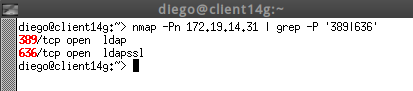
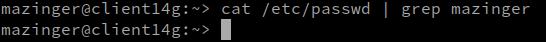

# Cliente para autenticación LDAP
# 1. Preparativos

* Supondremos que tenemos una MV1 (server14g) con DS-389 instalado, y con varios usuarios dentro del DS.
* Necesitamos una segunda máquina virtual (MV2) con S.O. OpenSUSE.

Comprobamos el acceso al LDAP desde el cliente:
* `nmap -Pn 172.19.14.31 | grep -P '389|636'`, para comprobar que el servidor LDAP es accesible desde el cliente. \

* `ldapsearch -H ldap://172.19.14.31:389 -W -D "cn=Directory Manager" -b "dc=ldap14,dc=curso2021" "(uid=*)" | grep dn`, comprobamos que los usuarios del LDAP remoto son visibles en el cliente. \


# 2. Configurar la autenticación LDAP

## 2.1 Crear conexión con el servidor

Vamos a configurar de la conexión del cliente con el servidor LDAP.

* Iremos a la MV cliente.
* Nos aseguramos de tener bien el nombre del equipo y nombre de dominio (`/etc/hostname`, `/etc/hosts`)
* Vamos a `YaST -> Cliente LDAP y Kerberos`.
* Lo configuraremos como la siguiente imagen:
    * DN de usuario: `cn=Directory Manager`
    * Contraseña: CLAVE del `cn=Directory Manager`


* Al final usaremos la opción de `Probar conexión`: \


## 2.2 Comprobar con comandos

* Vamos a la consola con usuario root, y probamos lo siguiente:

```
id mazinger
su -l mazinger   # Entramos con el usuario definido en LDAP

getent passwd mazinger          # Comprobamos los datos del usuario
cat /etc/passwd | grep mazinger # El usuario NO es local
```




---
