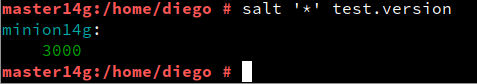

# 1. Salt-stack

Hay varias herramientas conocidas del tipo gestor de infrastructura como Puppet, Chef, Ansible y Terraform.


## 1.1 Preparativos

| Config   | MV1           | MV2          | MV3          |
| -------- | ------------- | ------------ | ------------ |
| Alias    | Master        | Minion       | Minion2      |
| Hostname | master14g     | minion14g    | minion14w    |
| SO       | OpenSUSE      | OpenSUSE     | Windows      |
| IP       | 172.19.14.31  | 172.19.14.32 | 172.19.14.11 |


---
# 2. Master: instalar y configurar.

* Vamos a la MV1 y haremos `zypper install salt-master`, para instalar el software del Máster.

    

> ATENCIÓN: El fichero de configuración siguiente tiene formato YAML.
>
> 1. Los valores de clave(key) principal no tienen espacios por delante.
> 2. El resto de valores de clave(key) secundarios tendrán 2 espacios o 4 espacios por delante.
>
> Hay que cumplir estas restricciones para que el contenido del dichero sea válido.

* Modificaremos `/etc/salt/master` para configurar nuestro Máster con:
```
interface: 172.19.14.31
file_roots:
  base:
    - /srv/salt
```


* `systemctl enable salt-master.service`, activaremos el servicio en el arranque del sistema.
* `systemctl start salt-master.service`, iniciaremos el servicio.
* `salt-key -L`, para consultar Minions aceptados por nuestro Máster. Vemos que no hay ninguno todavía.

    

---
# 3. Minion

Los Minions son los equipos que van a estar bajo el control del Máster.

## 3.1 Instalación y configuración

* `zypper install salt-minion`, instalaremos el software del agente (minion).

    

* Modificar `/etc/salt/minion` para definiremos quien será nuestro Máster:
```
master: 172.19.14.31
```


* `systemctl enable salt-minion.service`, activaremos Minion en el arranque del sistema.
* `systemctl start salt-minion.service`, iniciaremos el servico del Minion.

    

* Comprobaremos que no tenemos instalado `apache2` en el Minion.

    


## 3.2 Cortafuegos

Hay que asegurarse de que el cortafuegos permite las conexiones al servicio Salt.

* Iremos a la MV1 Máster.
* `firewall-cmd --get-active-zones`, consultaremos la zona de red. El resultado será public, dmz o algún otro. Sólo se debe aplicar a las zonas necesarias.

    

* `firewall-cmd --zone=public --add-port=4505-4506/tcp --permanent`, abrirem0os el puerto de forma permanente en la zona "public".

    

* `firewall-cmd reload`, reiniciar el firewall para que los cambios surtan efecto.

    


## 3.3 Aceptación desde el Master

Ir a MV1:
* `salt-key -L`, vemos que el Máster recibe petición del Minion.
```
Accepted Keys:
Denied Keys:
Unaccepted Keys:
minion14g
Rejected Keys:
```


* `salt-key -a minion14g`, para que el Máster acepte a dicho Minion.

    

* `salt-key -L`, comprobamos.

    

## 3.4 Comprobamos conectividad

Desde el Máster comprobamos:
1. Conectividad hacia los Minions.
```
# salt '*' test.ping
minion14g:
    True
```


2. Versión de Salt instalada en los Minions
```
# salt '*' test.version
minion14g:
    2019.2.0
```

> El símbolo `'*'` representa a todos los minions aceptados. Se puede especificar un minion o conjunto de minios concretos.



---
# 4. Salt States

## 4.1 Preparar el directorio para los estados

Vamos a crear directorios para guardar lo estados de Salt. Los estados de Salt son definiciones de cómo queremos que estén nuestras máquinas.

Ir a la MV Máster:
* Crear directorios `/srv/salt/base` y `/srv/salt/devel`.

    

* Crear archivo `/etc/salt/master.d/roots.conf` con el siguiente contenido:
```
file_roots:
  base:
    - /srv/salt/base
  devel:
    - /srv/salt/devel
```


* Reiniciar el servicio del Máster.

    

Hemos creado los directorios para:
* base = para guardar nuestros estados.
* devel = para desarrollo o para hacer pruebas.


## 4.2 Crear un nuevo estado

Los estados de Salt se definen en ficheros SLS.
* Crear fichero `/srv/salt/base/apache/init.sls`:
```
install_apache:
  pkg.installed:
    - pkgs:
      - apache2

apache_service:
  service.running:
    - name: apache2
    - enable: True
    - require:
     - pkg: apache2
```


Entendamos las definiciones:
* Nuestro nuevo estado se llama `apache` porque el directorio donde están las definiciones se llama `srv/salt/base/apache`.
* La primera línea es un identificador (Por ejemplo: `install_apache` o `apache_service`), y es un texto que ponemos nosotros libremente, de forma que nos ayude a identificar lo que vamos a definir.
* `pkg.installed`: Es una orden de salt que asegura que los paquetes estén instalados.
* `service.running`: Es una orden salt que asegura de que los servicios estén iniciados o parados.


## 4.3 Asociar Minions a estados

Ir al Máster:
* Crear `/srv/salt/base/top.sls`, donde asociamos a todos los Minions con el estado que acabamos de definir.
```
base:       
  '*':
    - apache
```


## 4.4 Comprobar: estados definidos

* `salt '*' state.show_states`, consultar los estados que tenemos definidos para cada Minion:

```
minion14g:
    - apache
```


## 4.5 Aplicar el nuevo estado

Ir al Master:
* Consultar los estados en detalle y verificar que no hay errores en las definiciones.
    * `salt '*' state.show_lowstate`

    

    * `salt '*' state.show_highstate`,

    

* `salt '*' state.apply apache`, para aplicar el nuevo estado en todos los minions. OJO: Esta acción puede tardar un tiempo.

    
    


```
minion14g:
----------
          ID: install_apache
    Function: pkg.installed
      Result: True
     Comment: The following packages were installed/updated: apache2
              ...
----------
          ID: apache_service
    Function: service.running
        Name: apache2
      Result: True
     Comment: Service apache2 has been enabled, and is running
              ...

Summary for minion14g
------------
Succeeded: 2 (changed=2)
Failed:    0
------------
Total states run:     2
Total run time: 105.971 s
```

> NOTA: Con este comando `salt '*' state.highstate`, también se pueden invocar todos los estados.

---
# 5. Crear más estados

## 5.1 Crear estado "users"

> Enlaces de interés:
>
> * [Create groups](https://docs.saltstack.com/en/latest/ref/states/all/salt.states.group.html)
> * [Create users](https://docs.saltstack.com/en/master/ref/states/all/salt.states.user.html)

Vamos a crear un estado llamado `users` que nos servirá para crear un grupo y usuarios en las máquinas Minions.

* Crear directorio `/srv/salt/base/users`.
* Crear fichero `/srv/salt/base/users/init.sls` con las definiones para crear los siguiente:
    * Grupo `mazingerz`
    * Usuarios `koji14`, `drinfierno14` dentro de dicho grupo.

    

* Aplicar el estado.

    
    

## 5.2 Crear estado "dirs"
> Enlace de interés:
>
> * [Gestión de ficheros](https://docs.saltstack.com/en/getstarted/config/files.html)

* Crear estado `dirs` para crear las carpetas `private` (700), `public` (755) y `group` (750) en el home del usuario `koji` (ver ejemplos en el ANEXO).

    

* Aplicar el estado `dirs`.

    

## 5.3 Ampliar estado "apache"

* Crearemos el fichero `srv/salt/files/holamundo.html`. Escribiremos dentro el nombre del alumno y la fecha actual.

    

* Incluir en el estado "apache" la creación del fichero `holamundo` en el Minion. Dicho fichero se descargará desde el servidor Salt Máster.

El código a añadir es el siguiente:


La solución aportada por la compañera para que funcione es copiar el fichero `holamundo.html` a `/srv/salt/base/files`. Entonces al aplicar el estado, obtenemos que se copia satisfactoriamente.


---
# 6. Añadir Minion de otro SO

## 6.1 Minion con Windows

* Crear MV3 con SO Windows (minion14w)
* Instalar `salt-minion` en MV3.
* El instalador nos da la opción de iniciar el servicio del minion. Pero también podemos iniciarlo desde una consola como administrador ejecutando `sc start salt-minion`.
* Ir a MV1(Máster) y aceptar al minion.

## 6.2 Aplicar estado

* Crear un estado para el Minion de Windows únicamente.
* Aplicar estado al Minion de Windows.

---
