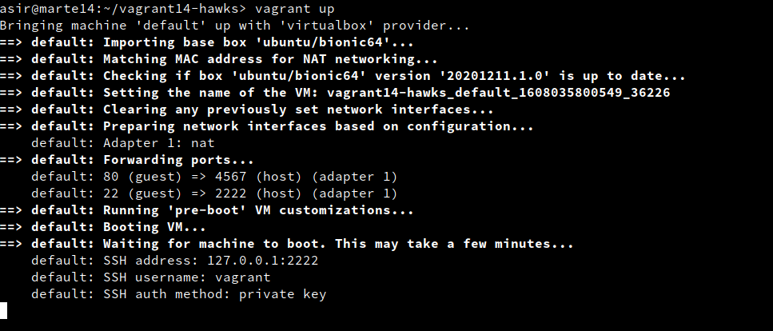
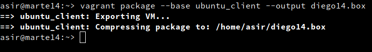

# 1. Introducción

Según *Wikipedia*:

Vagrant es una herramienta para la creación
y configuración de entornos de desarrollo virtualizados.

Originalmente se desarrolló para VirtualBox y sistemas de configuración
tales como Chef, Salt y Puppet.

Sin embargo desde la versión 1.1 Vagrant es capaz de trabajar con múltiples proveedores,
como VMware, Amazon EC2, LXC, DigitalOcean, etc.2

Aunque Vagrant se ha desarrollado en Ruby se puede usar en multitud de
proyectos escritos en otros lenguajes.

> NOTA: Para desarrollar esta actividad se ha utilizado principalmente
la información del enlace anterior publicado por Jonathan Wiesel, el 16/07/2013.

---
# 2. Instalación de Vagrant

La instalación vamos a hacerla en una máquina real.
* Instalar Vagrant. (En caso de no estar instalado)
* Hay que comprobar que las versiones de ambos programas son compatibles entre sí.
    * `vagrant version`, para comprobar la versión actual de Vagrant.
    * `VBoxManage -v`, para comprobar la versión actual de VirtualBox.

    
---
# 3. Proyecto Celtics

## 3.1 Imagen, caja o box

Existen muchos repositorios desde donde podemos descargar la cajas de Vagrant (Imágenes o boxes). Incluso podemos descargarnos cajas de otros sistemas oprativos desde [VagrantCloud Box List](https://app.vagrantup.com/boxes/search?provider=virtualbox)


* `vagrant box add ubuntu/bionic64`, descargar la caja que necesitamos a través de vagrant.
* `vagrant box list`, lista las cajas/imágenes disponibles actualmente en nuestra máquina.

    

## 3.2 Directorio

* Crearemos un directorio para nuestro proyecto.

```
mkdir vagrant14-celtics
cd vagrant14-celtics
```


A partir de ahora vamos a trabajar dentro de esta carpeta.
* Crear el fichero `Vagrantfile` de la siguiente forma:
```
Vagrant.configure("2") do |config|
  config.vm.box = "ubuntu/bionic64"
  config.vm.hostname = "diego14-celtics"
  config.vm.provider "virtualbox"
end
```
> NOTA: Con `vagrant init` se crea un fichero `Vagrantfile` con las opciones por defecto.

    

## 3.3 Comprobar

Vamos a crear una MV nueva y la vamos a iniciar usando Vagrant:
* Debemos estar dentro de `vagrant14-celtics`.
* `vagrant up`, para iniciar una nueva instancia de la máquina.

    
* `vagrant ssh`: Nos conectaremos/entraremos en nuestra máquina virtual usando SSH.

    

> **Otros comandos últiles de Vagrant**:
> * `vagrant suspend`: Suspender la máquina virtual. Tener en cuenta que la MV en modo **suspendido** consume más espacio en disco debido a que el estado de la máquina virtual que suele almacenarse en la RAM se pasa a disco.
> * `vagrant resume` : Volver a despertar la máquina virtual.
> * `vagrant halt`: Apagarla la máquina virtual.
> * `vagrant status`: Estado actual de la máquina virtual.
> * `vagrant destroy`: Para eliminar la máquina virtual (No los ficheros de configuración).

---
# 4. Ejemplos de configuración de Vagrantfile (TEORÍA)

**Carpetas compartidas**

La carpeta del proyecto que contiene el `Vagrantfile` es visible
para el sistema el virtualizado, esto nos permite compartir archivos fácilmente entre los dos entornos.

Ejemplos para configurar las carpetas compartidas:
* `config.vm.synced_folder ".", "/vagrant"`: La carpeta del proyecto es accesible desde /vagrant de la MV.
* `config.vm.synced_folder "html", "/var/www/html"`. La carpeta htdocs del proyecto es accesible desde /var/www/html de la MV.

**Redireccionamiento de los puertos**

Cuando trabajamos con máquinas virtuales, es frecuente usarlas para proyectos enfocados a la web, y para acceder a las páginas es necesario configurar el enrutamiento de puertos.

* `config.vm.network "private_network", ip: "192.168.33.10"`: Ejemplo para configurar la red.

**Conexión SSH**: Ejemplo para personalizar la conexión SSH a nuestra máquina virtual:

```
config.ssh.username = 'root'
config.ssh.password = 'vagrant'
config.ssh.insert_key = 'true'
```

Ejemplo para configurar la ejecución remota de aplicaciones gráficas instaladas en la máquina virtual, mediante SSH:
```
config.ssh.forward_agent = true
config.ssh.forward_x11 = true
```

---
# 5. Proyecto Hawks

Ahora vamos a hacer otro proyecto añadiendo la redirección de puertos.

## 5.1 Creación del proyecto Hawks

* Crearemos la carpeta `vagrant14-hawks`, y entraremos en el directorio.

    

* Crearemos el proyecto Vagrant.
* Configuraremos y modificaremos el fichero `Vagrantfile`, de modo que el puerto 4567 del sistema anfitrión sea enrutado al puerto 80 del ambiente virtualizado. \
La siguiente línea añade lo anteriormente nombrado:
  * `config.vm.network :forwarded_port, host: 4567, guest: 80`

    

* `vagrant ssh`, entramos en la MV.

    

    

* Instalamos `apache2`.

    

> NOTA: Cuando la MV está iniciada y queramos recargar el fichero de configuración si ha cambiado hacemos `vagrant reload`.

## 5.2 Comprobación

Para confirmar que hay un servicio a la escucha en 4567, desde la máquina real podemos ejecutar los siguientes comandos:

* `vagrant port` para ver la redirección de puertos de la máquina Vagrant.

    

* En la máquina real, abrimos el navegador web con el URL `http://127.0.0.1:4567`. En realidad estamos accediendo al puerto 80 de nuestro sistema virtualizado.

    

---
# 6. Suministro

Una de los mejores aspectos de Vagrant es el uso de herramientas de suministro. Esto es, ejecutar "una receta" o una serie de scripts durante el proceso de arranque del entorno virtual para instalar, configurar y personalizar un sin fin de aspectos del SO del sistema anfitrión.

* `vagrant halt`, apagamos la MV.
* `vagrant destroy` y la destruimos para volver a empezar.

    

## 6.1 Proyecto Lakers (Suministro mediante shell script)

Ahora vamos a suministrar a la MV un pequeño script para instalar Apache.
* Crear directorio `vagrant14-lakers` para nuestro proyecto.
* Entrar en dicha carpeta.

    

* Crear la carpeta `html` y crear fichero `html/index.html` con el siguiente contenido:
```
<h1>Proyecto Lakers</h1>
<p>Curso202021</p>
<p>diego</p>
```

    

* Crearemos el script `install_apache.sh`, dentro del proyecto con el siguiente contenido:
```
#!/usr/bin/env bash
apt-get update
apt-get install -y apache2
```

    

Incluiremos en el fichero de configuración `Vagrantfile` lo siguiente:
* `config.vm.hostname = "diego14-lakers"`
* `config.vm.provision :shell, :path => "install_apache.sh"`, para indicar a Vagrant que debe ejecutar el script `install_apache.sh` dentro del entorno virtual.
* `config.vm.synced_folder "html", "/var/www/html"`, para sincronizar la carpeta exterior `html` con la carpeta interior. De esta forma el fichero "index.html" será visible dentro de la MV.

    

* `vagrant up`, para crear la MV.
    * Podremos notar, al iniciar la máquina, que en los mensajes de salida se muestran mensajes que indican cómo se va instalando el paquete de Apache que indicamos.

    

    

* Para verificar que efectivamente el servidor Apache ha sido instalado e iniciado, abrimos navegador en la máquina real con URL `http://127.0.0.1:4567`.

    


## 6.2 Proyecto Raptors (Suministro mediante Puppet)

Se pide hacer lo siguiente.
* Crear directorio `vagrant14-raptors` como nuevo proyecto Vagrant.
* Modificar el archivo `Vagrantfile` de la siguiente forma:

```
Vagrant.configure("2") do |config|
  ...
  config.vm.hostname = "diego14-raptors"
  ...
  # Nos aseguramos de tener Puppet en la MV antes de usarlo.
  config.vm.provision "shell", inline: "sudo apt-get update && sudo apt-get install -y puppet"

  # Hacemos aprovisionamiento con Puppet
  config.vm.provision "puppet" do |puppet|
    puppet.manifest_file = "diego14.pp"
  end
 end
```


> Cuando usamos `config.vm.provision "shell", inline: '"echo "Hola"'`, se ejecuta directamente el comando especificado en la MV. Es lo que llamaremos provisión inline.

* Ahora hay que crear el fichero `manifests/diego14.pp`, con las órdenes/instrucciones Puppet para instalar un programa determinado, en este caso el editor de texto `Kate`.

```
package { 'kate':
  ensure => 'present',
}
```


Para que se apliquen los cambios de configuración tenemos 2 caminos:
* **Con la MV encendida**
    1. `vagrant reload`, recargar la configuración.
    2. `vagrant provision`, volver a ejecutar la provisión.
* **Con la MV apagada**:
    1. `vagrant destroy`, destruir la MV.
    2. `vagrant up` volver a crearla.

---

# 7. Proyecto Bulls (Nuestra caja)

En los apartados anteriores hemos descargado una caja/box de un repositorio de Internet, y la hemos personalizado. En este apartado vamos a crear nuestra propia caja/box a partir de una MV de VirtualBox que tengamos.

## 7.1 Preparar la MV VirtualBox

**Elegir una máquina virtual**

Lo primero que tenemos que hacer es preparar nuestra máquina virtual con una configuración por defecto, por si queremos publicar nuestro Box, ésto se realiza para seguir un estándar y que todo el mundo pueda usar dicho Box.

* Crear una MV VirtualBox nueva o usar una que ya tengamos.
* Instalar OpenSSH Server en la MV.


**Crear usuario con aceso SSH**

Vamos a crear el usuario `vagrant`. Esto lo hacemos para poder acceder a la máquina virtual por SSH desde fuera con este usuario. Y luego, a este usuario le agregamos una clave pública para autorizar el acceso sin clave
desde Vagrant. Veamos cómo:

* Ir a la MV de VirtualBox.
* Crearemos el usuario `vagrant` en la MV:
    * su
    * useradd -m vagrant
* Poner clave "vagrant" al usuario vagrant.
* Poner clave "vagrant" al usuario root.

    

* Configuramos acceso por clave pública al usuario vagrant:
    * `mkdir -pm 700 /home/vagrant/.ssh`, creamos la carpeta de configuración SSH.
    * `wget --no-check-certificate 'https://raw.github.com/mitchellh/vagrant/master/keys/vagrant.pub' -O /home/vagrant/.ssh/authorized_keys, descargamos la clave pública.
    chmod 0600 /home/vagrant/.ssh/authorized_keys`, modificamos los permisos de la carpeta.
    * `chown -R vagrant /home/vagrant/.ssh`, modificamos el propietario de la carpeta.

    

**Sudoers**

Tenemos que conceder permisos al usuario `vagrant` para que pueda configurar la red, instalar software, montar carpetas compartidas, etc. Para ello debemos configurar el fichero `/etc/sudoers` (Podemos usar el comando `visudo`) para que no nos solicite la password de root, cuando realicemos estas operaciones con el usuario `vagrant`.

* Añadiremos `vagrant ALL=(ALL) NOPASSWD: ALL` al fichero de configuración `/etc/sudoers`.

> Hay que comprobar que no existe una linea indicando requiretty, y si existe la comentamos.

    

**Añadir las VirtualBox Guest Additions**

* Debemos asegurarnos que tenemos instalado las VirtualBox Guest Additions con una versión compatible con el host anfitrión.


* Apagamos la MV.

## 7.2 Crear caja Vagrant

Una vez hemos preparado la máquina virtual ya podemos crear el box.

* Vamos a crear una nueva carpeta `vagrant14-bulls`, para este nuevo proyecto vagrant.
* `VBoxManage list vms`, es un comando de VirtualBox que muestra los nombres de nuestras MVs. Elegiremos una de las máquinas (VMNAME).


* Nos aseguramos que la MV de VirtualBox VMNAME está apagada.
* `vagrant package --base VMNAME diego.box`, parar crear nuestra propia caja.



* Comprobamos que se ha creado el fichero `diego14.box` en el directorio donde hemos ejecutado el comando.


* `vagrant box add diego/bulls diego14.box`, añadimos la nueva caja creada por nosotros, al repositorio local de cajas vagrant de nuestra máquina.


* `vagrant box list`, consultar ahora la lista de cajas Vagrant disponibles.


## 7.3 Usar la nueva caja

* Crear un nuevo Vagrantfile para usar nuestra caja.


* Levantamos la MV.
* Nos debemos conectar sin problemas (`vagant ssh`).

Cuando terminemos la práctica, ya no nos harán falta las cajas (boxes) que tenemos cargadas en nuestro repositorio local. Por tanto, podemos borrarlas para liberar espacio en disco:

* `vagrant box list`, para consultar las cajas disponibles.
* `vagrant box remove BOXNAME`, para eliminar una caja BOXNAME de nuestro repositorio local.
---
